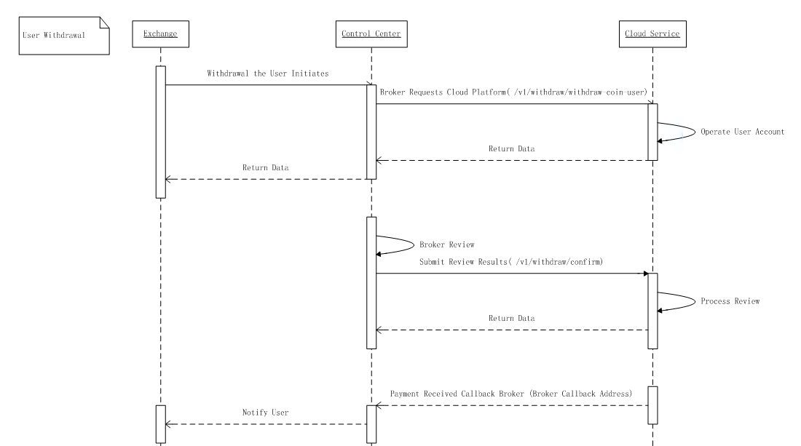
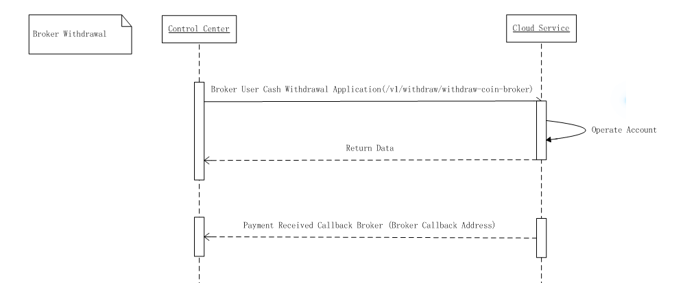

# MasterDAX Broker Service API Access Manual V1.0
--------------------
As a service provider, MasterDAX provides all brokers’ exchanges such services as exchange ordering and matching, user assets and cash withdrawal. Moreover, as the broker of exchanges, we will credit the gains of your handling fees into your account on T+0 day, and the assets can be withdrawaled at any time. 

## 1.Introduction
As the cloud service provider for exchanges, MasterDAX provides brokers and their users the following services:

| Role | Service Provided | Remarks |
| :---- | :----- | :----- |
| Broker user |Main functions such as user deposit, Token Trading, withdrawal, etc. | |
| Broker | The user's Token Trading fee and the withdrawal fee are settled to the broker's account on T+0 day.   | |


### 1.1 Access Preparation
After having signed a contract with MasterDAX, you will have a unique `broker ID`, brokerId, and a corresponding `accessKey`, `sercretKey`, for signature verification. Please provide the following information before access:
</br>

-  Callback address</br>
-  Bond IP, supporting up to 5 IPs

### 1.2 Instructions for Trade Process
#### 1.2.1 Broker’s User Trade Process
After accessing the interface provided by the documentation, the user can order,cancel order and operate others at the exchange. The specific process is as follows:




#### 1.2.2 Broker Settlement Process
Once the broker’s user generates fees (trade fee and withdrawal fee) on the exchange, MasterDAX will settle the broker's fee income to the broker's account opened in MasterDAX on `T+0` days as agreed. The broker may initiate any transfer the fee income to its own address via API at its discretion. The specific process is as follows: 



### 1.3 Request Interaction
#### 1.3.1 URI scheme
*Host* : ip:8080  
*BasePath* : /api

#### 1.3.2 Instructions to Request Interaction
1. Submittal
    
    Convert the encapsulated request parameters to `JSON format`, and submit them to the server via POST method. 

2. Server response

    The server firstly performs parameter security verification on the user request data, and after being verified, the response data will be responded to the client in `JSON format` according to the business logic.

<a name="signature"></a>

#### 1.3.3 Signature Method

1. Splicing `Body` data with the `secretKey` without any characters added
2. Sha256 encryption; convert to HEX uppercase strings

```
private String generateSign(String json, String secretKey) {
    String payload = json + secretKey;
    log.debug("payload：" + payload);
    return DigestUtils.sha256Hex(payload).toUpperCase();
}
```

## 2.Standard Interface for the Exchange
### 2.1 Configure Coins and symbols
> Please check the trade coins and symbols supported by the exchange before access. MasterDAX trade services are only available for the supported coins and symbols.  In case of any doubt, please contact the business professionals.

#### 2.1.1 Broker Coin List
Query all the coins supported by the exchanges
> Request method：POST</br>
> Interface name：[/v1/coin/broker-configAsset-list](#brokerassetlistusingpost)

#### 2.1.2 Broker symbol List
Query all the symbols supported by the exchanges
> Request method：POST</br>
> Interface name：[/v1/symbol/symbols/coin](#getsymbolsbycoinusingpost)

#### 2.1.3 Input Broker’s symbols and Handling Fees
The symbols of the broker's exchange, like `EOS/BTC`, needs to be input into MasterDAX before obtaining such data as depth and K-line.</br>
**Note**：The fees is maintained by the broker. MasterDAX will calculate the user’s fee based on this field when the trade is matched.
> Request method：POST</br>
> Interface name：[/v1/symbol/save-update-fee](#addfeeusingpost)


#### 2.1.4 Query Broker’s Input symbols Fee
##### 2.1.4.1 Single symbol query
> Request method：POST</br>
> Interface name：[/v1/symbol/get-fee](#getfeeusingpost)


##### 2.1.4.2 All symbols list query

> Request method：POST</br>
> Interface name：[/v1/symbol/get-fees](#getfeeusingpost_1)


### 2.2 User Assets
#### 2.2.1 Create a User
After the broker's user completing the registration, the user's `uid` needs to be synchronized to MasterDAX, so that the user can complete subsequent deposit, trade and other operations.
> Request method：POST</br>
> Interface name： [/v1/user/create-user](#createuserusingpost)

#### 2.2.2 Modify Whitelist Users
The broker can set a whitelist for a specific user, and the whitelist user’s trade fee is 0.

> Request method：POST</br>
> Interface name： [/v1/user/modify-whitelist](#modifywhitelistusingpost)


#### 2.2.2 User Assets Query
Supports querying all of the user's assets, including available balances and frozen balances.

> Request method：POST</br>
> Interface name： [/v1/asset/accounts](#getuseraccountassetsusingpost)


### 2.3 User Deposit
#### 2.3.1 Get User Deposit Address
When the user clicking on the deposit, an interface can be called to obtain the deposit address. If the user didn’t have any deposit address system before, the system will automatically assign one for him. 
> Request method：POST</br>
> Interface name： [/v1/coin-transfer/in-address-query](#getcointransferinaddressusingpost)


#### 2.3.2 User Deposit Callback
After the user deposits his account, the callback address provided by the broker is called back to the broker for notifying that the account is deposited. 
> Request method：POST</br>
> Interface name： [DepositCallBack](#depositCallBack)


#### 2.3.3 Deposit Record Query
Support for querying  deposit records of single user and all users.

> Request method：POST</br>
> Interface name： [/v1/deposit/deposit-coin-details](#getdepositcoinusingpost)

    
### 2.4 Exchange
#### 2.4.1 Market Depth Query
Support for querying all depth data of MasterDAX.
> Request method：GET</br>
> Interface name： [/trade/trade?symbol=symbolCode](#getdepthendpoint)


#### 2.4.2 Get K-line
Support for querying all K-line of MasterDAX.

> Request method：POST</br>Symbol
> Interface name： [/v1/data/kline/kline-pages](#getklinepagesusingpost)


#### 2.4.3 GET Historical trades
Supports for querying the historical trade records of MasterDAX by symbol
> Request method：POST</br>
> Interface name： [/trade/info?symbol=BTC_EOS](#gettradedendpoint)

#### 2.4.4 24H Data Query
Support the latest trade price of a certain symbol, 24H up and down, 24H highest price, 24H lowest price, 24H volume and other data.
> Request method：GET</br>
> Interface name： [/trade/detail](#gettradedetail)


#### 2.4.5 User Trade Ordering
The user's order on a certain symbol is sent to MasterDAX for processing.
> Request method：POST</br>
> Interface name： [/v1/match/order](#matchorderusingpost)


#### 2.4.6  User Order Cancellation
The user's order cancellation on a certain symbol is sent to MasterDAX for processing.

> Request method：POST</br>
> Interface name： [/v1/match/match-order/cancel](#cancelmatchorderusingpost)


#### 2.4.7  User Order Status Query
According to the order number, the information such as the status of the order of the user in a certain symbol is queried.
> Request method：POST</br>
> Interface name：  [/v1/match/order-query](#orderqueryusingpost)


#### 2.4.8 User In-progress Order List Query
Query the user's order list for a symbol order with a status of `waiting` and `pending`.

> Request method：POST</br>
> Interface name： [/v1/match/match-order/current](#getmatchorderdetailusingpost)

#### 2.4.9 User Processed Order Query
Query the user's order list for a certain symbol order with a status of `success` and `cancel`.

> Request method：POST</br>
> Interface name：  [/v1/match/match-order/history](#gethistorymatchorderusingpost)


#### 2.4.10 Query all User's trade Records
Query the trade orders list for all users on a symbol order.

> Request method：POST</br>
> Interface name：  [/v1/trade/userTradeRecord](#getusertraderecordusingpost)


### 2.5 User Withdrawal
#### 2.5.1 Broker User Coin Withdrawal Application
This interface is called when the user initiates the withdrawal operation to deduct its corresponding assets.
> Request method：POST</br>
> Interface name：  [/v1/withdraw/withdraw-coin-user](#userwithdrawcoinusingpost)


#### 2.5.2 Query User’s Amount to be Withdrawn
When the user initiates the withdrawal operation, This interface is called to query the current balance that can be withdrawn.
> Request method：POST</br>
> Interface name：  [/v1/withdraw/query-balance](#querybalanceusingpost)


#### 2.5.3 Query Withdrawals Unverified 
If the user-initiated withdrawal request needs to be reviewed in the broker's control center, the interface can be queried to obtain the unverified amount of the withdrawal request for a certain coin.

> Request method：POST</br>
> Interface name：  [/v1/withdraw/unverifiedCount](#queryunverifiedcountusingpost)


#### 2.5.4 User Withdrawal Confirmation
If the user-initiated withdrawal request needs to be reviewed in the broker's control center, this interface can be queried. Once review status sent is `PASS`, Withdrawal will be triggered and callbacked to the broker, if the review status sent is `REFUSE`, the system will refund the coins deducted to the user’s assets.

> Request method：POST</br>
> Interface name：  [/v1/withdraw/confirm](#confirmusingpost)


#### 2.5.5 Query User’s Total Amount Withdrawn
The total withdrawal amount that the user initiates.

> Request method：POST</br>
> Interface name：  [/v1/withdraw/queryWithdrawTotal](#querywithdrawtotalusingpost)


#### 2.5.6 Query User’s Withdrawal Records
Query the user-initiated withdrawal record, which can be queried by `UID` and `Status`. Display all user withdrawal records when `UID` is `NULL`.
 

> Request method：POST</br>
> Interface name：[/v1/withdraw/withdraw-coin-details](#getwithdrawcoinusingpost)

#### 2.5.7 User Withdrawal Callback
After the user withdraws the account or withdraws the trigger limit, the audit failure callback notifies the broker.

> Request method：POST</br>
> Interface name： [运营商提供的回调地址](#withdrawCallBack)


## 3.Broker Settlement API
The fee generated by the user trades will be settled to the broker in real time on `T+0` day. The broker can query and settle in the settlement account.

### 3.1  Settlement Account Asset Query
Query the total assets of the broker's settlement account, and the fee generated by the user trades and withdrawal fee will enter into the settlement account.
 

> Request method：POST</br>
> Interface name：  [/v1/coin/brokerAsset-query](#querybrokerfinanceusingpost)


### 3.2 Settlement Account Asset Withdraw Application
The assets in the settlement account can be transferred to the broker's own address.
 

> Request method：POST</br>
> Interface name：  [/v1/withdraw/withdraw-coin-broker](#brokerwithdrawcoinusingpost)


### 3.3 Settlement Account Asset Withdraw Status Callback
After the successful application of transfer out of the settlement account, the system will callback the withdraw status to the broker, and the status includes `REFUSE` and `RECEIVED`.

> Request method：POST</br>
> Interface name： [Callback address provided by the insurer](#withdrawCallBack)


### 3.4 Settlement Account Asset Withdraw  Record Query
Query the assets withdraw records of the settlement account. When `UID=0`, means the broker's withdraw records.
 

> Request method：POST</br>
> Interface name：  [/v1/withdraw/withdraw-coin-details](#getwithdrawcoinusingpost)


### 3.5 symbol Sharing Ratio Query
Query the fee generated by the user trades and symbol sharing ratio of MasterDAX.
 

> Request method：POST</br>
> Interface name：  [/v1/symbol/sharings](#getsharingusingpost)


### 3.6 Settlement Record Query
Query the fee settlement records generated by user trades and withdrawals.
 

> Request method：POST</br>
> Interface name：  [/v1/settle/settle-record](#querysettlerecordusingpost)


## 4.Error Code

|code|msg|
|---|---|
|**SUCCESS**|Success|//Success
|**FAIL**|Success|//成功
|**PARAM_ERROR**|Parameter error|  //参数错误
|**SIGN_ERROR**|Signature error|
|**DUPLICATE_DATA**|Signature error|
|**EMPTY_RECORD**|Empty record|
|**TOO_MANY_RECORDS**|Too many records|
|**REPEAT_MESSAGE**|Repeated message|  //重复的消息
|**USER_NOT_EXIST**|User not exist|
|**BROKER_ASSET_NOT_EXIST**|Broker assets not exist|
|**BROKER_ASSET_EXIST**|Broker asset exist|
|**SYMBOL_FORMAT_ERROR**|Symbol format error|
|**INVALID_SYMBOL**|Invalid symbol|
|**ORDER_CREATE_ERROR**|Invalid symbol|
|**ORDER_NOT_EXIST**|Order not exist|
|**ORDER_STATE_ERROR**|Order status error|
|**ORDER_HAD_CANCELLED**|Order cancelled|
|**ORDER_HAD_PROCESSING**|Order processing|
|**ORDER_HAD_TRADED**|Order has been traded|
|**NO_PERMISSION**|No permission|  //没有权限
|**BROKER_NOT_EXIST**|Broker not exist|
|**ADDRESS_ASSIGN_ERROR**|Address assign error|
|**MESSAGE_TO_MQ_FAIL**|Message to MQ failed|
|**ADDRESS_STATUS_ERROR**|Address status error|
|**ACCOUNT_STATUS_ERROR**|Account status error|
|**WITHDRAW_FEE_TOO_LOW**|Withdrawal fee is lower than fee|
|**WITHDRAW_TOO_LOW**|Withdrawal amount is less than fee|
|**COIN_ASSERT_LESS**|Coin asset is not enough|
|**COIN_LOCK_ASSERT_LESS**|Locked asset is not enough|
|**ADDRESS_DELETE_ERROR**|Address deletion error|
|**WITHDRAW_ORDER_STAUTS_ERROR**|Withdrawal order status error|
|**WITHDRAW_ORDER_STAUTS_UPDATE_ERROR**|Withdrawal order status update error|
|**DEPOSIT_ORDER_STAUTS_ERROR**|Deposit order status error|
|**DEPOSIT_ORDER_NOT_EXIST**|Deposit order not exist|
|**COIN_DEPOSIT_ADDRESS_INVALID**|Coin deposit address invalid|
|**DEPOSIT_ORDER_INSERT_ERROR**|Deposit order insert error|
|**DEPOSIT_ORDER_STAUTS_UPDATE_ERROR**|Deposit order status update error|
|**USER_TOTAL_LIMIT**|User number limit|
|**WITHDRAW_ASSETCODE_NOT_SUPPORT**|Withdrawal coin symbol not supported|
|**UPDATE_FINANCE_ERROR**|Asset update error|
|**BATCH_INSERT_FINANCEDETAIL_ERROR**|Asset batch update error|

# cloud-exchange-api

<a name="paths"></a>
## ENDPOINT

<a name="getdepthendpoint"></a>
### Depth
```
GET `/trade/trade?symbol=`symbolCode
```

#### Parameters

|Parameter name|   Parameter type|   Required| Description|
| :-----    | :-----   | :-----    | :-----   |
|symbolCode|String|Yes|Symbol (filled into the URL path)|


#### Responses example

```
{
    "sell": [
        [
            0.00002736, 
            1071.36299794
        ], 
        [
            0.00002738, 
            0.19978522
        ], 
        [
            0.00002742, 
            75.9087355
        ]
    ], 
    "buy": [
        [
            0.00002618, 
            16.33033728
        ], 
        [
            0.00002611, 
            605.26813127
        ], 
        [
            0.0000261, 
            499.81630013
        ]
    ]
}
```


### 24HOURS
```
GET /trade/detail
```
   
#### Responses example

```
{
  "BTC_TRX": {
    "24high": "",
    "24low": "",
    "24Total": "",
    "24Price": ""
  },
  "BTC_KCASH": {
    "24high": "",
    "24low": "",
    "24Total": "",
    "24Price": ""
  },
  "BTC_STORJ": {
    "24high": "0.00006868000000000000",
    "24low": "0.00006615000000000000",
    "24Total": "7046.20000000000000000000",
    "newPrice": 6.807e-05,
    "24Price": "0.00006766000000000000"
  }
}
```

<a name="gettradedendpoint"></a>
### TRADED ORDER
```
GET /trade/info?symbol=BTC_EOS
```

#### Parameters

|Parameter name|   Parameter type|   Required| Description|
| :-----    | :-----   | :-----    | :-----   |
|symbol|String|Yes|Symbol (filled into the URL path)
|

#### Responses example

```
{
    "24high": "0.00129310000000000000", 
    "24low": "0.00087410000000000000", 
    "24Total": "95162.53042596000000000000", 
    "order": [
        {
            "time": "1523503566", 
            "type": "SELL", 
            "num": 9.15, 
            "price": 0.0012772
        }, 
        {
            "time": "1523503506", 
            "type": "BUY", 
            "num": 2.3165, 
            "price": 0.00128
        }
    ], 
    "24Price": "0.00087520000000000000"
}
```

<a name="paths"></a>
## Paths

<a name="getuseraccountassetsusingpost"></a>
### User asset query (based on the symbol that the broker supports and assigns to user symbol list)
```
POST /v1/asset/accounts
```


#### Parameters

|Type|Name|Description|Schema|
|---|---|---|---|
|**Header**|**accessKey**  <br>*required*|Access Key|string|
|**Header**|**sign**  <br>*required*|Signature|string|
|**Body**|**request**  <br>*required*|request|[BrokerAssetAccountRequest](#brokerassetaccountrequest)|


#### Responses

|HTTP Code|Description|Schema|
|---|---|---|
|**200**|OK|[ApiResponse«List«AssetDto»»](#d26b592b71e05154ee6b33c6f7a261cc)|
|**201**|Created|No Content|
|**401**|Unauthorized|No Content|
|**403**|Forbidden|No Content|
|**404**|Not Found|No Content|


#### Consumes

* `application/json`


#### Produces

* `\*/*`


#### Tags

* user-asset-controller


<a name="getcointransferinaddressusingpost"></a>
### Get User deposit Address
```
POST /v1/coin-transfer/in-address-query
```


#### Parameters

|Type|Name|Description|Schema|
|---|---|---|---|
|**Header**|**accessKey**  <br>*required*|Access Key|string|
|**Header**|**sign**  <br>*required*|Signature|string|
|**Body**|**assetRequest**  <br>*required*|assetRequest|[AssetRequest](#assetrequest)|


#### Responses

|HTTP Code|Description|Schema|
|---|---|---|
|**200**|OK|[ApiResponse«List«TransferInAddressDto»»](#ed7ed4b8e03e4b9a2ee44094fecf6ffd)|
|**201**|Created|No Content|
|**401**|Unauthorized|No Content|
|**403**|Forbidden|No Content|
|**404**|Not Found|No Content|


#### Consumes

* `application/json`


#### Produces

* `\*/*`


#### Tags

* coin-address-man-controller

<a name="depositCallBack"></a>
### Deposit Callback

#### Parameters

|Type|Name|Description|Schema|
|---|---|---|---|
|**Header**|**accessKey**  <br>*required*|Access Key|string|
|**Header**|**sign**  <br>*required*|Signature|string|
|**Body**|**DepositApiResponseDto**  <br>*required*|DepositApiResponseDto|[DepositApiResponseDto](#DepositApiResponseDto)|


#### Responses

|HTTP Code|Description|Schema|
|---|---|---|
|**200**|OK|

#### Consumes

* `application/json`


#### Produces

* `\*/*`


#### Tags

<a name="brokerassetlistusingpost"></a>
### Broker Coin List Query (including Withdrawal Fee)
```
POST /v1/coin/broker-configAsset-list
```


#### Parameters

|Type|Name|Description|Schema|
|---|---|---|---|
|**Header**|**accessKey**  <br>*required*|Access Key|string|
|**Header**|**sign**  <br>*required*|Signature|string|
|**Body**|**request**  <br>*required*|request|[BrokerAssetRequest](#brokerassetrequest)|


#### Responses

|HTTP Code|Description|Schema|
|---|---|---|
|**200**|OK|[ApiResponse«List«BrokerConfigAssetDto»»](#29d3eb9515674d5e992cf7c3fcea8a5b)|
|**201**|Created|No Content|
|**401**|Unauthorized|No Content|
|**403**|Forbidden|No Content|
|**404**|Not Found|No Content|


#### Consumes

* `application/json`


#### Produces

* `\*/*`


#### Tags

* asset-manager-controller


<a name="querybrokerfinanceusingpost"></a>
### Broker Settlement Account Asset Query
```
POST /v1/coin/brokerAsset-query
```


#### Parameters

|Type|Name|Description|Schema|
|---|---|---|---|
|**Header**|**accessKey**  <br>*required*|Access Key|string|
|**Header**|**sign**  <br>*required*|Signature|string|
|**Body**|**request**  <br>*required*|request|[PageRequest](#pagerequest)|


#### Responses

|HTTP Code|Description|Schema|
|---|---|---|
|**200**|OK|[ApiResponse«BrokerPageModel«BrokerAssetDto»»](#3129640bc337647a01d923c78ac55f72)|
|**201**|Created|No Content|
|**401**|Unauthorized|No Content|
|**403**|Forbidden|No Content|
|**404**|Not Found|No Content|


#### Consumes

* `application/json`


#### Produces

* `\*/*`


#### Tags

* asset-manager-controller


<a name="getklinepagesusingpost"></a>
### Get K-line (Paged Query)
```
POST /v1/data/kline/kline-pages
```


#### Parameters

|Type|Name|Description|Schema|
|---|---|---|---|
|**Header**|**accessKey**  <br>*required*|Access Key|string|
|**Header**|**sign**  <br>*required*|Signature|string|
|**Body**|**req**  <br>*required*|req|[KlineQueryReq](#klinequeryreq)|


#### Responses

|HTTP Code|Description|Schema|
|---|---|---|
|**200**|OK|[ApiResponse«KlineQueryPages»](#8710d779824389ca515611e3c22f2f66)|
|**201**|Created|No Content|
|**401**|Unauthorized|No Content|
|**403**|Forbidden|No Content|
|**404**|Not Found|No Content|


#### Consumes

* `application/json`


#### Produces

* `\*/*`


#### Tags

* kline-query-controller


<a name="getdepositcoinusingpost"></a>
### Broker User Deposit Record Query
```
POST /v1/deposit/deposit-coin-details
```


#### Parameters

|Type|Name|Description|Schema|
|---|---|---|---|
|**Header**|**accessKey**  <br>*required*|Access Key|string|
|**Header**|**sign**  <br>*required*|Signature|string|
|**Body**|**request**  <br>*required*|request|[DepositQueryRequest](#depositqueryrequest)|


#### Responses

|HTTP Code|Description|Schema|
|---|---|---|
|**200**|OK|[ApiResponse«PageModel«DepositDetailDto»»](#82c577a03b8be584493954e6197f9b45)|
|**201**|Created|No Content|
|**401**|Unauthorized|No Content|
|**403**|Forbidden|No Content|
|**404**|Not Found|No Content|


#### Consumes

* `application/json`


#### Produces

* `\*/*`


#### Tags

* deposit-coin-controller


<a name="cancelmatchorderusingpost"></a>
### User Order Cancellation
```
POST /v1/match/match-order/cancel
```


#### Parameters

|Type|Name|Description|Schema|
|---|---|---|---|
|**Header**|**accessKey**  <br>*required*|Access Key|string|
|**Header**|**sign**  <br>*required*|Signature|string|
|**Body**|**req**  <br>*required*|req|[CancelOrderReq](#cancelorderreq)|


#### Responses

|HTTP Code|Description|Schema|
|---|---|---|
|**200**|OK|[ApiResponse«Void»](#196cc3be9a21471c8e871b4fb9019cae)|
|**201**|Created|No Content|
|**401**|Unauthorized|No Content|
|**403**|Forbidden|No Content|
|**404**|Not Found|No Content|


#### Consumes

* `application/json`


#### Produces

* `\*/*`


#### Tags

* match-order-controller


<a name="getmatchorderdetailusingpost"></a>
### User in-progress Order List Query
```
POST /v1/match/match-order/current
```


#### Parameters

|Type|Name|Description|Schema|
|---|---|---|---|
|**Header**|**accessKey**  <br>*required*|Access Key|string|
|**Header**|**sign**  <br>*required*|Signature|string|
|**Body**|**req**  <br>*required*|req|[MatchOrderPageQueryReq](#matchorderpagequeryreq)|


#### Responses

|HTTP Code|Description|Schema|
|---|---|---|
|**200**|OK|[ApiResponse«PageInfo«MatchOrderDetail»»](#af561c25b8a6a1a5325d4e5de5fcefa2)|
|**201**|Created|No Content|
|**401**|Unauthorized|No Content|
|**403**|Forbidden|No Content|
|**404**|Not Found|No Content|


#### Consumes

* `application/json`


#### Produces

* `\*/*`


#### Tags

* match-order-controller


<a name="gethistorymatchorderusingpost"></a>
### User Processed Order Status Query
```
POST /v1/match/match-order/history
```


#### Parameters

|Type|Name|Description|Schema|
|---|---|---|---|
|**Header**|**accessKey**  <br>*required*|Access Key|string|
|**Header**|**sign**  <br>*required*|Signature|string|
|**Body**|**req**  <br>*required*|req|[MatchOrderPageQueryReq](#matchorderpagequeryreq)|


#### Responses

|HTTP Code|Description|Schema|
|---|---|---|
|**200**|OK|[ApiResponse«PageInfo«MatchOrderDetail»»](#af561c25b8a6a1a5325d4e5de5fcefa2)|
|**201**|Created|No Content|
|**401**|Unauthorized|No Content|
|**403**|Forbidden|No Content|
|**404**|Not Found|No Content|


#### Consumes

* `application/json`


#### Produces

* `\*/*`


#### Tags

* match-order-controller


<a name="matchorderusingpost"></a>
### User Trade Ordering
```
POST /v1/match/order
```


#### Parameters

|Type|Name|Description|Schema|
|---|---|---|---|
|**Header**|**accessKey**  <br>*required*|Access Key|string|
|**Header**|**sign**  <br>*required*|Signature|string|
|**Body**|**req**  <br>*required*|req|[MatchOrderReq](#matchorderreq)|


#### Responses

|HTTP Code|Description|Schema|
|---|---|---|
|**200**|OK|[ApiResponse«Void»](#196cc3be9a21471c8e871b4fb9019cae)|
|**201**|Created|No Content|
|**401**|Unauthorized|No Content|
|**403**|Forbidden|No Content|
|**404**|Not Found|No Content|


#### Consumes

* `application/json`


#### Produces

* `\*/*`


#### Tags

* match-order-controller


<a name="orderqueryusingpost"></a>
### User Single Order Status Query
```
POST /v1/match/order-query
```


#### Parameters

|Type|Name|Description|Schema|
|---|---|---|---|
|**Header**|**accessKey**  <br>*required*|Access Key|string|
|**Header**|**sign**  <br>*required*|Signature|string|
|**Body**|**req**  <br>*required*|req|[QueryOrderReq](#queryorderreq)|


#### Responses

|HTTP Code|Description|Schema|
|---|---|---|
|**200**|OK|[MatchOrderDetail](#matchorderdetail)|
|**201**|Created|No Content|
|**401**|Unauthorized|No Content|
|**403**|Forbidden|No Content|
|**404**|Not Found|No Content|


#### Consumes

* `application/json`


#### Produces

* `\*/*`


#### Tags

* match-order-controller


<a name="querysettlerecordusingpost"></a>
### Broker Settlement Record Query
```
POST /v1/settle/settle-record
```


#### Parameters

|Type|Name|Description|Schema|
|---|---|---|---|
|**Header**|**accessKey**  <br>*required*|Access Key|string|
|**Header**|**sign**  <br>*required*|Signature|string|
|**Body**|**request**  <br>*required*|request|[SettleQueryRequest](#settlequeryrequest)|


#### Responses

|HTTP Code|Description|Schema|
|---|---|---|
|**200**|OK|[ApiResponse«PageModel«SettleRecordDto»»](#29fbac2cdffd95d8715e7846d92debdd)|
|**201**|Created|No Content|
|**401**|Unauthorized|No Content|
|**403**|Forbidden|No Content|
|**404**|Not Found|No Content|


#### Consumes

* `application/json`


#### Produces

* `\*/*`


#### Tags

* settle-manager-controller


<a name="getfeeusingpost"></a>

### Single symbol Query
```
POST /v1/symbol/get-fee
```


#### Parameters

|Type|Name|Description|Schema|
|---|---|---|---|
|**Header**|**accessKey**  <br>*required*|Access Key|string|
|**Header**|**sign**  <br>*required*|Signature|string|
|**Body**|**req**  <br>*required*|req|[SymbolFeeQueryReq](#symbolfeequeryreq)|


#### Responses

|HTTP Code|Description|Schema|
|---|---|---|
|**200**|OK|[ApiResponse«BrokerSymbolFeeData»](#b51c21747b9194b617a696eca5e3e0b7)|
|**201**|Created|No Content|
|**401**|Unauthorized|No Content|
|**403**|Forbidden|No Content|
|**404**|Not Found|No Content|


#### Consumes

* `application/json`


#### Produces

* `\*/*`


#### Tags

* symbol-controller


<a name="getfeeusingpost_1"></a>

### Query all symbols List
```
POST /v1/symbol/get-fees
```


#### Parameters

|Type|Name|Description|Schema|
|---|---|---|---|
|**Header**|**accessKey**  <br>*required*|Access Key|string|
|**Header**|**sign**  <br>*required*|Signature|string|
|**Body**|**req**  <br>*required*|req|[SymbolFeeListQueryReq](#symbolfeelistqueryreq)|


#### Responses

|HTTP Code|Description|Schema|
|---|---|---|
|**200**|OK|[ApiResponse«List«BrokerSymbolFeeData»»](#eaeff6f989d4756651fba9d76ad90043)|
|**201**|Created|No Content|
|**401**|Unauthorized|No Content|
|**403**|Forbidden|No Content|
|**404**|Not Found|No Content|


#### Consumes

* `application/json`


#### Produces

* `\*/*`


#### Tags

* symbol-controller


<a name="addfeeusingpost"></a>
### Input Coil Pairs and Fees
```
POST /v1/symbol/save-update-fee
```


#### Parameters

|Type|Name|Description|Schema|
|---|---|---|---|
|**Header**|**accessKey**  <br>*required*|Access Key|string|
|**Header**|**sign**  <br>*required*|Signature|string|
|**Body**|**req**  <br>*required*|req|[SymbolFeeAddReq](#symbolfeeaddreq)|


#### Responses

|HTTP Code|Description|Schema|
|---|---|---|
|**200**|OK|[ApiResponse«BrokerSymbolFeeData»](#b51c21747b9194b617a696eca5e3e0b7)|
|**201**|Created|No Content|
|**401**|Unauthorized|No Content|
|**403**|Forbidden|No Content|
|**404**|Not Found|No Content|


#### Consumes

* `application/json`


#### Produces

* `\*/*`


#### Tags

* symbol-controller


<a name="getsharingusingpost"></a>
### Symbol Sharing Ratio Query
```
POST /v1/symbol/sharings
```


#### Parameters

|Type|Name|Description|Schema|
|---|---|---|---|
|**Header**|**accessKey**  <br>*required*|Access Key|string|
|**Header**|**sign**  <br>*required*|Signature|string|
|**Query**|**nanoTime**  <br>*required*|Current Timestamp (nanoseconds)|integer (int64)|


#### Responses

|HTTP Code|Description|Schema|
|---|---|---|
|**200**|OK|[ApiResponse«SymbolSharingData»](#ceae0169df711b82935661c7d4227567)|
|**201**|Created|No Content|
|**401**|Unauthorized|No Content|
|**403**|Forbidden|No Content|
|**404**|Not Found|No Content|


#### Consumes

* `application/json`


#### Produces

* `\*/*`


#### Tags

* symbol-controller


<a name="getsymbolsbycoinusingpost"></a>
### Symbol List Query by Coins
```
POST /v1/symbol/symbols/coin
```


#### Parameters

|Type|Name|Description|Schema|
|---|---|---|---|
|**Header**|**accessKey**  <br>*required*|Access Key|string|
|**Header**|**sign**  <br>*required*|Signature|string|
|**Body**|**req**  <br>*required*|req|[SymbolQueryReq](#symbolqueryreq)|


#### Responses

|HTTP Code|Description|Schema|
|---|---|---|
|**200**|OK|[ApiResponse«List«SymbolData»»](#b01ba55e3561c1ba9febd8ca5bc3539b)|
|**201**|Created|No Content|
|**401**|Unauthorized|No Content|
|**403**|Forbidden|No Content|
|**404**|Not Found|No Content|


#### Consumes

* `application/json`


#### Produces

* `\*/*`


#### Tags

* symbol-controller


<a name="getusertraderecordusingpost"></a>
### Broker User Trade Record Query
```
POST /v1/trade/userTradeRecord
```


#### Parameters

|Type|Name|Description|Schema|
|---|---|---|---|
|**Header**|**accessKey**  <br>*required*|Access Key|string|
|**Header**|**sign**  <br>*required*|Signature|string|
|**Body**|**request**  <br>*required*|request|[TradeOrderQueryRequest](#tradeorderqueryrequest)|


#### Responses

|HTTP Code|Description|Schema|
|---|---|---|
|**200**|OK|[ApiResponse«PageModel«TradeOrderDto»»](#fb7634128e52b8535dc169001707afec)|
|**201**|Created|No Content|
|**401**|Unauthorized|No Content|
|**403**|Forbidden|No Content|
|**404**|Not Found|No Content|


#### Consumes

* `application/json`


#### Produces

* `\*/*`


#### Tags

* trade-manager-controller


<a name="createuserusingpost"></a>
### Create User
```
POST /v1/user/create-user
```


#### Parameters

|Type|Name|Description|Schema|
|---|---|---|---|
|**Header**|**accessKey**  <br>*required*|Access Key|string|
|**Header**|**sign**  <br>*required*|Signature|string|
|**Body**|**req**  <br>*required*|req|[CreateUserReq](#createuserreq)|


#### Responses

|HTTP Code|Description|Schema|
|---|---|---|
|**200**|OK|[ApiResponse«UserData»](#7d001d219a176986c8b2752c3f4d05d3)|
|**201**|Created|No Content|
|**401**|Unauthorized|No Content|
|**403**|Forbidden|No Content|
|**404**|Not Found|No Content|


#### Consumes

* `application/json`


#### Produces

* `\*/*`


#### Tags

* user-controller


<a name="modifywhitelistusingpost"></a>
### Modify Whitelist User
```
POST /v1/user/modify-whitelist
```


#### Parameters

|Type|Name|Description|Schema|
|---|---|---|---|
|**Header**|**accessKey**  <br>*required*|Access Key|string|
|**Header**|**sign**  <br>*required*|Signature|string|
|**Body**|**req**  <br>*required*|req|[ModifyWhitelistReq](#modifywhitelistreq)|


#### Responses

|HTTP Code|Description|Schema|
|---|---|---|
|**200**|OK|[ApiResponse«Void»](#196cc3be9a21471c8e871b4fb9019cae)|
|**201**|Created|No Content|
|**401**|Unauthorized|No Content|
|**403**|Forbidden|No Content|
|**404**|Not Found|No Content|


#### Consumes

* `application/json`


#### Produces

* `\*/*`


#### Tags

* user-controller


<a name="confirmusingpost"></a>
### Broker User Coin Withdrawal Confirmation
```
POST /v1/withdraw/confirm
```


#### Parameters

|Type|Name|Description|Schema|
|---|---|---|---|
|**Header**|**accessKey**  <br>*required*|Access Key|string|
|**Header**|**sign**  <br>*required*|Signature|string|
|**Body**|**request**  <br>*required*|request|[WithdrawConfirmRequest](#withdrawconfirmrequest)|


#### Responses

|HTTP Code|Description|Schema|
|---|---|---|
|**200**|OK|[ApiResponse«Void»](#196cc3be9a21471c8e871b4fb9019cae)|
|**201**|Created|No Content|
|**401**|Unauthorized|No Content|
|**403**|Forbidden|No Content|
|**404**|Not Found|No Content|


#### Consumes

* `application/json`


#### Produces

* `\*/*`


#### Tags

* withdraw-coin-controller


<a name="querybalanceusingpost"></a>
### Query Balance to be Withdrawn
```
POST /v1/withdraw/query-balance
```


#### Parameters

|Type|Name|Description|Schema|
|---|---|---|---|
|**Header**|**accessKey**  <br>*required*|Access Key|string|
|**Header**|**sign**  <br>*required*|Signature|string|
|**Body**|**assetRequest**  <br>*required*|assetRequest|[AssetRequest](#assetrequest)|


#### Responses

|HTTP Code|Description|Schema|
|---|---|---|
|**200**|OK|[ApiResponse«bigdecimal»](#62e4a694d927f3a9133cf1942a9a9102)|
|**201**|Created|No Content|
|**401**|Unauthorized|No Content|
|**403**|Forbidden|No Content|
|**404**|Not Found|No Content|


#### Consumes

* `application/json`


#### Produces

* `\*/*`


#### Tags

* withdraw-coin-controller


<a name="querywithdrawtotalusingpost"></a>
### Total Withdrawals
```
POST /v1/withdraw/queryWithdrawTotal
```


#### Parameters

|Type|Name|Description|Schema|
|---|---|---|---|
|**Header**|**accessKey**  <br>*required*|Access Key|string|
|**Header**|**sign**  <br>*required*|Signature|string|
|**Body**|**request**  <br>*required*|request|[WithdrawTotalAmountRequest](#withdrawtotalamountrequest)|


#### Responses

|HTTP Code|Description|Schema|
|---|---|---|
|**200**|OK|[ApiResponse«Map«string,bigdecimal»»](#71933e463130fcc6486fb5fb5f34c23e)|
|**201**|Created|No Content|
|**401**|Unauthorized|No Content|
|**403**|Forbidden|No Content|
|**404**|Not Found|No Content|


#### Consumes

* `application/json`


#### Produces

* `\*/*`


#### Tags

* withdraw-coin-controller


<a name="queryunverifiedcountusingpost"></a>
### Single Coin Withdrawal Unverified
```
POST /v1/withdraw/unverifiedCount
```


#### Parameters

|Type|Name|Description|Schema|
|---|---|---|---|
|**Header**|**accessKey**  <br>*required*|Access Key|string|
|**Header**|**sign**  <br>*required*|Signature|string|
|**Body**|**request**  <br>*required*|request|[UnVerifiedCountRequest](#unverifiedcountrequest)|


#### Responses

|HTTP Code|Description|Schema|
|---|---|---|
|**200**|OK|[ApiResponse«Map«string,int»»](#3a2cb5618d3fe80bff232572e56c295a)|
|**201**|Created|No Content|
|**401**|Unauthorized|No Content|
|**403**|Forbidden|No Content|
|**404**|Not Found|No Content|


#### Consumes

* `application/json`


#### Produces

* `\*/*`


#### Tags

* withdraw-coin-controller


<a name="brokerwithdrawcoinusingpost"></a>
### Broker Assets Withdraw Application
```
POST /v1/withdraw/withdraw-coin-broker
```


#### Parameters

|Type|Name|Description|Schema|
|---|---|---|---|
|**Header**|**accessKey**  <br>*required*|Access Key|string|
|**Header**|**sign**  <br>*required*|Signature|string|
|**Body**|**request**  <br>*required*|request|[BrokerWithdrawRequest](#brokerwithdrawrequest)|


#### Responses

|HTTP Code|Description|Schema|
|---|---|---|
|**200**|OK|[ApiResponse«Void»](#196cc3be9a21471c8e871b4fb9019cae)|
|**201**|Created|No Content|
|**401**|Unauthorized|No Content|
|**403**|Forbidden|No Content|
|**404**|Not Found|No Content|


#### Consumes

* `application/json`


#### Produces

* `\*/*`


#### Tags

* withdraw-coin-controller


<a name="getwithdrawcoinusingpost"></a>
### Broker Withdraw Records
```
POST /v1/withdraw/withdraw-coin-details
```


#### Parameters

|Type|Name|Description|Schema|
|---|---|---|---|
|**Header**|**accessKey**  <br>*required*|Access Key|string|
|**Header**|**sign**  <br>*required*|Signature|string|
|**Body**|**withdrawQueryRequest**  <br>*required*|withdrawQueryRequest|[WithdrawQueryRequest](#withdrawqueryrequest)|


#### Responses

|HTTP Code|Description|Schema|
|---|---|---|
|**200**|OK|[ApiResponse«PageModel«WithdrawCoinDetailDto»»](#14dace88a1a7adb1791a784b47a8aef9)|
|**201**|Created|No Content|
|**401**|Unauthorized|No Content|
|**403**|Forbidden|No Content|
|**404**|Not Found|No Content|


#### Consumes

* `application/json`


#### Produces

* `\*/*`


#### Tags

* withdraw-coin-controller


<a name="userwithdrawcoinusingpost"></a>
### Broker User Coin Withdrawal Application
```
POST /v1/withdraw/withdraw-coin-user
```


#### Parameters

|Type|Name|Description|Schema|
|---|---|---|---|
|**Header**|**accessKey**  <br>*required*|Access Key|string|
|**Header**|**sign**  <br>*required*|Signature|string|
|**Body**|**request**  <br>*required*|request|[WithdrawCoinRequest](#withdrawcoinrequest)|


#### Responses

|HTTP Code|Description|Schema|
|---|---|---|
|**200**|OK|[ApiResponse«Void»](#196cc3be9a21471c8e871b4fb9019cae)|
|**201**|Created|No Content|
|**401**|Unauthorized|No Content|
|**403**|Forbidden|No Content|
|**404**|Not Found|No Content|


#### Consumes

* `application/json`


#### Produces

* `\*/*`


#### Tags

* withdraw-coin-controller

<a name="withdrawCallBack"></a>
### Withdrawal Callback

#### Parameters

|Type|Name|Description|Schema|
|---|---|---|---|
|**Header**|**accessKey**  <br>*required*|Access Key|string|
|**Header**|**sign**  <br>*required*|Signature|string|
|**Body**|**WithdrawApiResponseDto**  <br>*required*|WithdrawApiResponseDto|[WithdrawApiResponseDto](#WithdrawApiResponseDto)|


#### Responses

|HTTP Code|Description|Schema|
|---|---|---|
|**200**|OK|

#### Consumes

* `application/json`


#### Produces

* `\*/*`


<a name="definitions"></a>
## Definitions

<a name="3129640bc337647a01d923c78ac55f72"></a>
### ApiResponse«BrokerPageModel«BrokerAssetDto»»

|Name|Description|Schema|
|---|---|---|
|**code**  <br>*required*|Response Code|string|
|**data**  <br>*optional*||[BrokerPageModel«BrokerAssetDto»](#488103a3791c82bc492f8243b6885fb0)|
|**msg**  <br>*required*|Response Message|string|
|**ret**  <br>*required*|Response success  <br>**Example** : `false`|boolean|


<a name="b51c21747b9194b617a696eca5e3e0b7"></a>
### ApiResponse«BrokerSymbolFeeData»

|Name|Description|Schema|
|---|---|---|
|**code**  <br>*required*|Response Code|string|
|**data**  <br>*optional*||[BrokerSymbolFeeData](#brokersymbolfeedata)|
|**msg**  <br>*required*|Response Message|string|
|**ret**  <br>*required*|Response success  <br>**Example** : `false`|boolean|


<a name="8710d779824389ca515611e3c22f2f66"></a>
### ApiResponse«KlineQueryPages»

|Name|Description|Schema|
|---|---|---|
|**code**  <br>*required*|Response Code|string|
|**data**  <br>*optional*||[KlineQueryPages](#klinequerypages)|
|**msg**  <br>*required*|Response Message|string|
|**ret**  <br>*required*|Response success  <br>**Example** : `false`|boolean|


<a name="d26b592b71e05154ee6b33c6f7a261cc"></a>
### ApiResponse«List«AssetDto»»

|Name|Description|Schema|
|---|---|---|
|**code**  <br>*required*|Response Code|string|
|**data**  <br>*optional*||< [AssetDto](#assetdto) > array|
|**msg**  <br>*required*|Response Message|string|
|**ret**  <br>*required*|Response success  <br>**Example** : `false`|boolean|


<a name="29d3eb9515674d5e992cf7c3fcea8a5b"></a>
### ApiResponse«List«BrokerConfigAssetDto»»

|Name|Description|Schema|
|---|---|---|
|**code**  <br>*required*|Response Code|string|
|**data**  <br>*optional*||< [BrokerConfigAssetDto](#brokerconfigassetdto) > array|
|**msg**  <br>*required*|Response Message|string|
|**ret**  <br>*required*|Response success  <br>**Example** : `false`|boolean|


<a name="eaeff6f989d4756651fba9d76ad90043"></a>
### ApiResponse«List«BrokerSymbolFeeData»»

|Name|Description|Schema|
|---|---|---|
|**code**  <br>*required*|Response Code|string|
|**data**  <br>*optional*||< [BrokerSymbolFeeData](#brokersymbolfeedata) > array|
|**msg**  <br>*required*|Response Message|string|
|**ret**  <br>*required*|Response success  <br>**Example** : `false`|boolean|


<a name="b01ba55e3561c1ba9febd8ca5bc3539b"></a>
### ApiResponse«List«SymbolData»»

|Name|Description|Schema|
|---|---|---|
|**code**  <br>*required*|Response Code|string|
|**data**  <br>*optional*||< [SymbolData](#symboldata) > array|
|**msg**  <br>*required*|Response Message|string|
|**ret**  <br>*required*|Response success  <br>**Example** : `false`|boolean|


<a name="ed7ed4b8e03e4b9a2ee44094fecf6ffd"></a>
### ApiResponse«List«TransferInAddressDto»»

|Name|Description|Schema|
|---|---|---|
|**code**  <br>*required*|Response Code|string|
|**data**  <br>*optional*||< [TransferInAddressDto](#transferinaddressdto) > array|
|**msg**  <br>*required*|Response Message|string|
|**ret**  <br>*required*|Response success  <br>**Example** : `false`|boolean|


<a name="71933e463130fcc6486fb5fb5f34c23e"></a>
### ApiResponse«Map«string,bigdecimal»»

|Name|Description|Schema|
|---|---|---|
|**code**  <br>*required*|Response Code|string|
|**data**  <br>*optional*||< string, number > map|
|**msg**  <br>*required*|Response Message|string|
|**ret**  <br>*required*|Response success  <br>**Example** : `false`|boolean|


<a name="3a2cb5618d3fe80bff232572e56c295a"></a>
### ApiResponse«Map«string,int»»

|Name|Description|Schema|
|---|---|---|
|**code**  <br>*required*|Response Code|string|
|**data**  <br>*optional*||< string, integer (int32) > map|
|**msg**  <br>*required*|Response Message|string|
|**ret**  <br>*required*|Response success  <br>**Example** : `false`|boolean|


<a name="af561c25b8a6a1a5325d4e5de5fcefa2"></a>
### ApiResponse«PageInfo«MatchOrderDetail»»

|Name|Description|Schema|
|---|---|---|
|**code**  <br>*required*|Response Code|string|
|**data**  <br>*optional*||[PageInfo«MatchOrderDetail»](#25f81bde9effd814e7bcf1ea7d73c4f7)|
|**msg**  <br>*required*|Response Message|string|
|**ret**  <br>*required*|Response success  <br>**Example** : `false`|boolean|


<a name="1a5f60cc3d37772c5c069b2403786fbf"></a>
### ApiResponse«PageInfo«MatchRecordDto»»

|Name|Description|Schema|
|---|---|---|
|**code**  <br>*required*|Response Code|string|
|**data**  <br>*optional*||[PageInfo«MatchRecordDto»](#0cb0127a416ce5c26ac2ee156711aacd)|
|**msg**  <br>*required*|Response Message|string|
|**ret**  <br>*required*|Response success  <br>**Example** : `false`|boolean|


<a name="82c577a03b8be584493954e6197f9b45"></a>
### ApiResponse«PageModel«DepositDetailDto»»

|Name|Description|Schema|
|---|---|---|
|**code**  <br>*required*|Response Code|string|
|**data**  <br>*optional*||[PageModel«DepositDetailDto»](#922592b0bd84c95143d881659b43f5b7)|
|**msg**  <br>*required*|Response Message|string|
|**ret**  <br>*required*|Response success  <br>**Example** : `false`|boolean|


<a name="29fbac2cdffd95d8715e7846d92debdd"></a>
### ApiResponse«PageModel«SettleRecordDto»»

|Name|Description|Schema|
|---|---|---|
|**code**  <br>*required*|Response Code|string|
|**data**  <br>*optional*||[PageModel«SettleRecordDto»](#d8c97f7a9a191de856d9bfd7162c1b88)|
|**msg**  <br>*required*|Response Message|string|
|**ret**  <br>*required*|Response success  <br>**Example** : `false`|boolean|


<a name="fb7634128e52b8535dc169001707afec"></a>
### ApiResponse«PageModel«TradeOrderDto»»

|Name|Description|Schema|
|---|---|---|
|**code**  <br>*required*|Response Code|string|
|**data**  <br>*optional*||[PageModel«TradeOrderDto»](#9832eb12068b6b1627b21ae6b1ac060c)|
|**msg**  <br>*required*|Response Message|string|
|**ret**  <br>*required*|Response success  <br>**Example** : `false`|boolean|


<a name="14dace88a1a7adb1791a784b47a8aef9"></a>
### ApiResponse«PageModel«WithdrawCoinDetailDto»»

|Name|Description|Schema|
|---|---|---|
|**code**  <br>*required*|Response Code|string|
|**data**  <br>*optional*||[PageModel«WithdrawCoinDetailDto»](#63fc5848d93402e6be9ab0d7419be4ca)|
|**msg**  <br>*required*|Response Message|string|
|**ret**  <br>*required*|Response success  <br>**Example** : `false`|boolean|


<a name="ceae0169df711b82935661c7d4227567"></a>
### ApiResponse«SymbolSharingData»

|Name|Description|Schema|
|---|---|---|
|**code**  <br>*required*|Response Code|string|
|**data**  <br>*optional*||[SymbolSharingData](#symbolsharingdata)|
|**msg**  <br>*required*|Response Message|string|
|**ret**  <br>*required*|Response success  <br>**Example** : `false`|boolean|


<a name="7d001d219a176986c8b2752c3f4d05d3"></a>
### ApiResponse«UserData»

|Name|Description|Schema|
|---|---|---|
|**code**  <br>*required*|Response Code|string|
|**data**  <br>*optional*||[UserData](#userdata)|
|**msg**  <br>*required*|Response Message|string|
|**ret**  <br>*required*|Response success  <br>**Example** : `false`|boolean|


<a name="196cc3be9a21471c8e871b4fb9019cae"></a>
### ApiResponse«Void»

|Name|Description|Schema|
|---|---|---|
|**code**  <br>*required*|Response Code|string|
|**msg**  <br>*required*|Response Message|string|
|**ret**  <br>*required*|Response success  <br>**Example** : `false`|boolean|


<a name="62e4a694d927f3a9133cf1942a9a9102"></a>
### ApiResponse«bigdecimal»

|Name|Description|Schema|
|---|---|---|
|**code**  <br>*required*|Response Code|string|
|**data**  <br>*optional*||number|
|**msg**  <br>*required*|Response Message|string|
|**ret**  <br>*required*|Response success  <br>**Example** : `false`|boolean|


<a name="assetdto"></a>
### AssetDto

|Name|Schema|
|---|---|
|**accountNo**  <br>*optional*|string|
|**amountAvailable**  <br>*optional*|number|
|**amountLock**  <br>*optional*|number|
|**assetCode**  <br>*optional*|string|
|**uid**  <br>*optional*|integer (int64)|


<a name="assetrequest"></a>
### AssetRequest

|Name|Description|Schema|
|---|---|---|
|**assetCode**  <br>*optional*|Coin Type|string|
|**uid**  <br>*optional*|User ID|integer (int64)|


<a name="brokerassetaccountrequest"></a>
### BrokerAssetAccountRequest

|Name|Description|Schema|
|---|---|---|
|**assetList**  <br>*optional*|List of broker’s Supported Coins|< string > array|
|**uid**  <br>*optional*|User ID|integer (int64)|


<a name="brokerassetdto"></a>
### BrokerAssetDto

|Name|Schema|
|---|---|
|**amountAvailable**  <br>*optional*|number|
|**amountLock**  <br>*optional*|number|
|**assetCode**  <br>*optional*|string|


<a name="brokerassetrequest"></a>
### BrokerAssetRequest

|Name|Description|Schema|
|---|---|---|
|**assetCode**  <br>*optional*|Coin Type|string|


<a name="brokerconfigassetdto"></a>
### BrokerConfigAssetDto

|Name|Schema|
|---|---|
|**assetCode**  <br>*optional*|string|
|**createDate**  <br>*optional*|string (date-time)|
|**name**  <br>*optional*|string|
|**status**  <br>*optional*|enum (INIT, LISTED, DELISTED)|
|**withdrawFee**  <br>*optional*|number|


<a name="488103a3791c82bc492f8243b6885fb0"></a>
### BrokerPageModel«BrokerAssetDto»

|Name|Schema|
|---|---|
|**assetCount**  <br>*optional*|integer (int64)|
|**brokerName**  <br>*optional*|string|
|**list**  <br>*optional*|< [BrokerAssetDto](#brokerassetdto) > array|
|**pageNo**  <br>*optional*|integer (int32)|
|**pageNum**  <br>*optional*|integer (int32)|
|**pageSize**  <br>*optional*|integer (int32)|
|**total**  <br>*optional*|integer (int64)|


<a name="brokersymbolfeedata"></a>
### BrokerSymbolFeeData

|Name|Description|Schema|
|---|---|---|
|**brokerId**  <br>*optional*|Broker ID|string|
|**feeMin**  <br>*optional*|Minimum Fee|number|
|**makerFeeRatio**  <br>*optional*|MAKER Fee Ratio|number|
|**method**  <br>*optional*|Fee Type|string|
|**priceAsset**  <br>*optional*|Pricing Asset|string|
|**takerFeeRatio**  <br>*optional*|TAKER Fee Ratio|number|
|**tradeAsset**  <br>*optional*|Trade Asset|string|


<a name="brokerwithdrawrequest"></a>
### BrokerWithdrawRequest

|Name|Description|Schema|
|---|---|---|
|**address**  <br>*optional*|Withdrawal Address|string|
|**amount**  <br>*optional*|Withdrawal Amount|number|
|**assetCode**  <br>*optional*|Coin Type|string|
|**clientOrderNo**  <br>*optional*|Client Order No.|string|
|**message**  <br>*optional*|Withdrawal Information|string|


<a name="cancelorderreq"></a>
### CancelOrderReq

|Name|Description|Schema|
|---|---|---|
|**clientOrderNo**  <br>*required*|Broker Order No.|string|
|**nanoTime**  <br>*required*|Current Timestamp (nanoseconds)|integer (int64)|


<a name="createuserreq"></a>
### CreateUserReq

|Name|Description|Schema|
|---|---|---|
|**birthday**  <br>*optional*|Birthday  <br>**Example** : `"2018-01-01"`|string|
|**brokerUid**  <br>*required*|Broker User ID|integer (int64)|
|**country**  <br>*optional*|Nationality|string|
|**email**  <br>*optional*|Broker User's Email|string|
|**gender**  <br>*optional*|Gender|string|
|**ip**  <br>*optional*|User Registration IP|string|
|**name**  <br>*optional*|User Name|string|
|**nanoTime**  <br>*required*|Current Timestamp (nanoseconds)|integer (int64)|
|**phone**  <br>*optional*|Phone No.|string|


<a name="depositdetaildto"></a>
### DepositDetailDto

|Name|Schema|
|---|---|
|**account**  <br>*optional*|string|
|**address**  <br>*optional*|string|
|**amount**  <br>*optional*|number|
|**assetCode**  <br>*optional*|string|
|**brokerId**  <br>*optional*|string|
|**createDate**  <br>*optional*|string (date-time)|
|**msg**  <br>*optional*|string|
|**orderNo**  <br>*optional*|string|
|**outOrderNo**  <br>*optional*|string|
|**status**  <br>*optional*|enum (CONFIRM, SUCCESS, FAILURE)|
|**uid**  <br>*optional*|integer (int64)|
|**updateDate**  <br>*optional*|string (date-time)|


<a name="depositqueryrequest"></a>
### DepositQueryRequest

|Name|Description|Schema|
|---|---|---|
|**address**  <br>*optional*|Wallet Address|string|
|**assetCode**  <br>*optional*|Coin Type|string|
|**endDate**  <br>*optional*|End Date|string (date-time)|
|**pageNo**  <br>*optional*|Pages|integer (int32)|
|**pageSize**  <br>*optional*|Page Size|integer (int32)|
|**startDate**  <br>*optional*|Start Date|string (date-time)|
|**status**  <br>*optional*|Deposit Status: CONFIRM, SUCCESS, FAILURE|enum (CONFIRM, SUCCESS, FAILURE)|
|**uid**  <br>*optional*|User ID|integer (int64)|


<a name="klinequerypages"></a>
### KlineQueryPages

|Name|Schema|
|---|---|
|**pages**  <br>*optional*|[Pages«KlineRecord»](#349f6b917324f326c7b17859b3a4b408)|


<a name="klinequeryreq"></a>
### KlineQueryReq

|Name|Description|Schema|
|---|---|---|
|**endTime**  <br>*required*|End Time (seconds)|integer (int64)|
|**kline**  <br>*required*|Type=1m, 5m, 15m, 30m ,1h, 1d|string|
|**nanoTime**  <br>*required*|Current Timestamp (nanoseconds)|integer (int64)|
|**pageNum**  <br>*required*|Pages=1|integer (int32)|
|**pageSize**  <br>*required*|Page Size|integer (int32)|
|**startTime**  <br>*required*|Start Time (seconds)|integer (int64)|
|**symbol**  <br>*required*|Symbol=tradeAsset_priceAsset|string|


<a name="klinerecord"></a>
### KlineRecord

|Name|Description|Schema|
|---|---|---|
|**amount**  <br>*optional*|Trade Volume|number|
|**close**  <br>*optional*|Closing Price|number|
|**klineType**  <br>*optional*|K-line Type|string|
|**lowPrice**  <br>*optional*|Low Price|number|
|**maxPrice**  <br>*optional*|Max Price|number|
|**open**  <br>*optional*|Starting Price|number|
|**symbol**  <br>*optional*|Symbol|string|
|**time**  <br>*optional*|Time|integer (int64)|


<a name="4211319230c057cdf99d0e4473178bfb"></a>
### Map«string,bigdecimal»
*Type* : < string, number > map


<a name="d764f4858e39dc9eee78f8c7d66455a6"></a>
### Map«string,int»
*Type* : < string, [Integer](#integer) > map


<a name="matchorderdetail"></a>
### MatchOrderDetail

|Name|Description|Schema|
|---|---|---|
|**clientOrderNo**  <br>*optional*|Broker Order No.|string|
|**createTime**  <br>*optional*|Order Creation Time|string (date-time)|
|**fee**  <br>*optional*|Broker User Fee Deduction|number|
|**feeAsset**  <br>*optional*|Fee Asset|string|
|**matchedMoney**  <br>*optional*|Filled Asset|number|
|**money**  <br>*optional*||number|
|**moneyOver**  <br>*optional*||number|
|**number**  <br>*optional*|Order Quantity|number|
|**numberOver**  <br>*optional*|Remaining Quantity|number|
|**orderState**  <br>*optional*|Trade Status|enum (WAITING, PROCESSING, SUCCESS, CANCEL, FAIL)|
|**orderType**  <br>*optional*|Order Types|enum (BUY, SELL)|
|**platformOrderNo**  <br>*optional*|Platform Order No.|string|
|**price**  <br>*optional*|Price|number|
|**priceAssert**  <br>*optional*|Pricing Asset|string|
|**tradeAssert**  <br>*optional*|Trading Asset |string|
|**tradeType**  <br>*optional*|Trade Type|enum (FIXED, MARKET)|
|**tradedNumber**  <br>*optional*|Match Number|number|


<a name="matchorderpagequeryreq"></a>
### MatchOrderPageQueryReq

|Name|Description|Schema|
|---|---|---|
|**brokerUid**  <br>*required*|Broker User ID|integer (int64)|
|**endTime**  <br>*optional*|End Time  <br>**Example** : `"2018-01-01 23:59:59"`|string (date-time)|
|**nanoTime**  <br>*required*|Current Timestamp (nanoseconds)|integer (int64)|
|**orderType**  <br>*optional*|Order Type|enum (BUY, SELL)|
|**pageNo**  <br>*optional*|Page|integer (int32)|
|**pageSize**  <br>*optional*|Page size|integer (int32)|
|**priceAsset**  <br>*required*|Pricing Asset|string|
|**startTime**  <br>*optional*|Start Time   <br>**Example** : `"2018-01-01 00:00:00"`|string (date-time)|
|**tradeAsset**  <br>*required*|Trading Asset |string|


<a name="matchorderreq"></a>
### MatchOrderReq

|Name|Description|Schema|
|---|---|---|
|**amount**  <br>*required*|Order Quantity|number|
|**brokerUid**  <br>*required*|Broker User ID|integer (int64)|
|**clientOrderNo**  <br>*required*|Broker Order No.|string|
|**nanoTime**  <br>*required*|Current Timestamp (nanoseconds)|integer (int64)|
|**orderType**  <br>*required*|Order Type|enum (BUY, SELL)|
|**price**  <br>*required*|Price|number|
|**priceAsset**  <br>*required*|Pricing Asset|string|
|**tradeAsset**  <br>*required*|Trading Asset |string|
|**tradeType**  <br>*required*|Trade Type|enum (FIXED, MARKET)|


<a name="matchrecorddto"></a>
### MatchRecordDto

|Name|Description|Schema|
|---|---|---|
|**createTime**  <br>*optional*|Creation Time|string (date-time)|
|**num**  <br>*optional*|Filled Number|number|
|**price**  <br>*optional*|Price|number|


<a name="matchrecordpagequeryreq"></a>
### MatchRecordPageQueryReq

|Name|Description|Schema|
|---|---|---|
|**brokerUid**  <br>*required*|Broker User ID|integer (int64)|
|**clientOrderNo**  <br>*required*|Broker Order No.|string|
|**nanoTime**  <br>*required*|Current Timestamp (nanoseconds)|integer (int64)|
|**pageNo**  <br>*optional*|Page|integer (int32)|
|**pageSize**  <br>*optional*|Size per Page|integer (int32)|
|**priceAsset**  <br>*optional*|Pricing Asset|string|
|**tradeAsset**  <br>*optional*|Trading Asset |string|


<a name="modifywhitelistreq"></a>
### ModifyWhitelistReq

|Name|Description|Schema|
|---|---|---|
|**brokerUid**  <br>*required*|Broker User ID|integer (int64)|
|**nanoTime**  <br>*required*|Current Timestamp (nanoseconds)|integer (int64)|
|**whiteList**  <br>*required*|Whitelist or Not<br>**Example** : `false`|boolean|


<a name="25f81bde9effd814e7bcf1ea7d73c4f7"></a>
### PageInfo«MatchOrderDetail»

|Name|Schema|
|---|---|
|**endRow**  <br>*optional*|integer (int32)|
|**firstPage**  <br>*optional*|integer (int32)|
|**hasNextPage**  <br>*optional*|boolean|
|**hasPreviousPage**  <br>*optional*|boolean|
|**isFirstPage**  <br>*optional*|boolean|
|**isLastPage**  <br>*optional*|boolean|
|**lastPage**  <br>*optional*|integer (int32)|
|**list**  <br>*optional*|< [MatchOrderDetail](#matchorderdetail) > array|
|**navigateFirstPage**  <br>*optional*|integer (int32)|
|**navigateLastPage**  <br>*optional*|integer (int32)|
|**navigatePages**  <br>*optional*|integer (int32)|
|**navigatepageNums**  <br>*optional*|< integer (int32) > array|
|**nextPage**  <br>*optional*|integer (int32)|
|**pageNum**  <br>*optional*|integer (int32)|
|**pageSize**  <br>*optional*|integer (int32)|
|**pages**  <br>*optional*|integer (int32)|
|**prePage**  <br>*optional*|integer (int32)|
|**size**  <br>*optional*|integer (int32)|
|**startRow**  <br>*optional*|integer (int32)|
|**total**  <br>*optional*|integer (int64)|


<a name="0cb0127a416ce5c26ac2ee156711aacd"></a>
### PageInfo«MatchRecordDto»

|Name|Schema|
|---|---|
|**endRow**  <br>*optional*|integer (int32)|
|**firstPage**  <br>*optional*|integer (int32)|
|**hasNextPage**  <br>*optional*|boolean|
|**hasPreviousPage**  <br>*optional*|boolean|
|**isFirstPage**  <br>*optional*|boolean|
|**isLastPage**  <br>*optional*|boolean|
|**lastPage**  <br>*optional*|integer (int32)|
|**list**  <br>*optional*|< [MatchRecordDto](#matchrecorddto) > array|
|**navigateFirstPage**  <br>*optional*|integer (int32)|
|**navigateLastPage**  <br>*optional*|integer (int32)|
|**navigatePages**  <br>*optional*|integer (int32)|
|**navigatepageNums**  <br>*optional*|< integer (int32) > array|
|**nextPage**  <br>*optional*|integer (int32)|
|**pageNum**  <br>*optional*|integer (int32)|
|**pageSize**  <br>*optional*|integer (int32)|
|**pages**  <br>*optional*|integer (int32)|
|**prePage**  <br>*optional*|integer (int32)|
|**size**  <br>*optional*|integer (int32)|
|**startRow**  <br>*optional*|integer (int32)|
|**total**  <br>*optional*|integer (int64)|


<a name="922592b0bd84c95143d881659b43f5b7"></a>
### PageModel«DepositDetailDto»

|Name|Schema|
|---|---|
|**list**  <br>*optional*|< [DepositDetailDto](#depositdetaildto) > array|
|**pageNo**  <br>*optional*|integer (int32)|
|**pageNum**  <br>*optional*|integer (int32)|
|**pageSize**  <br>*optional*|integer (int32)|
|**total**  <br>*optional*|integer (int64)|


<a name="d8c97f7a9a191de856d9bfd7162c1b88"></a>
### PageModel«SettleRecordDto»

|Name|Schema|
|---|---|
|**list**  <br>*optional*|< [SettleRecordDto](#settlerecorddto) > array|
|**pageNo**  <br>*optional*|integer (int32)|
|**pageNum**  <br>*optional*|integer (int32)|
|**pageSize**  <br>*optional*|integer (int32)|
|**total**  <br>*optional*|integer (int64)|


<a name="9832eb12068b6b1627b21ae6b1ac060c"></a>
### PageModel«TradeOrderDto»

|Name|Schema|
|---|---|
|**list**  <br>*optional*|< [TradeOrderDto](#tradeorderdto) > array|
|**pageNo**  <br>*optional*|integer (int32)|
|**pageNum**  <br>*optional*|integer (int32)|
|**pageSize**  <br>*optional*|integer (int32)|
|**total**  <br>*optional*|integer (int64)|


<a name="63fc5848d93402e6be9ab0d7419be4ca"></a>
### PageModel«WithdrawCoinDetailDto»

|Name|Schema|
|---|---|
|**list**  <br>*optional*|< [WithdrawCoinDetailDto](#withdrawcoindetaildto) > array|
|**pageNo**  <br>*optional*|integer (int32)|
|**pageNum**  <br>*optional*|integer (int32)|
|**pageSize**  <br>*optional*|integer (int32)|
|**total**  <br>*optional*|integer (int64)|


<a name="pagerequest"></a>
### PageRequest

|Name|Description|Schema|
|---|---|---|
|**pageNo**  <br>*optional*|Pages|integer (int32)|
|**pageSize**  <br>*optional*|Page Size|integer (int32)|


<a name="349f6b917324f326c7b17859b3a4b408"></a>
### Pages«KlineRecord»

|Name|Schema|
|---|---|
|**list**  <br>*optional*|< [KlineRecord](#klinerecord) > array|
|**pageNum**  <br>*optional*|integer (int32)|
|**pageSize**  <br>*optional*|integer (int32)|
|**pages**  <br>*optional*|integer (int64)|
|**size**  <br>*optional*|integer (int32)|
|**startIndex**  <br>*optional*|integer (int32)|
|**total**  <br>*optional*|integer (int64)|


<a name="queryorderreq"></a>
### QueryOrderReq

|Name|Description|Schema|
|---|---|---|
|**clientOrderNo**  <br>*required*|Broker Order No.|string|
|**nanoTime**  <br>*required*|Current Timestamp (nanoseconds)|integer (int64)|


<a name="settlequeryrequest"></a>
### SettleQueryRequest

|Name|Description|Schema|
|---|---|---|
|**assetCode**  <br>*optional*|Coin Type|string|
|**pageNo**  <br>*optional*|Pages|integer (int32)|
|**pageSize**  <br>*optional*|Page Size|integer (int32)|
|**type**  <br>*optional*|Settlement Type: BROKER_FEE (trade fee), WITHDRAW_BROKER_FEE (withdrawal fee)|enum (BROKER_FEE, WITHDRAW_BROKER_FEE)|


<a name="settlerecorddto"></a>
### SettleRecordDto

|Name|Schema|
|---|---|
|**amountAvailable**  <br>*optional*|number|
|**assetCode**  <br>*optional*|string|
|**brokerId**  <br>*optional*|string|
|**createDate**  <br>*optional*|string (date-time)|
|**requestNo**  <br>*optional*|string|
|**type**  <br>*optional*|enum (BROKER_FEE, WITHDRAW_BROKER_FEE)|


<a name="symbol"></a>
### Symbol

|Name|Description|Schema|
|---|---|---|
|**priceAsset**  <br>*required*|Pricing Asset|string|
|**tradeAsset**  <br>*required*|Trading Asset |string|


<a name="symboldata"></a>
### SymbolData

|Name|Description|Schema|
|---|---|---|
|**priceAsset**  <br>*optional*|Pricing Asset|string|
|**state**  <br>*optional*|Status：OPEN|string|
|**tradeAsset**  <br>*optional*|Trading Asset |string|


<a name="symbolfeeaddreq"></a>
### SymbolFeeAddReq

|Name|Description|Schema|
|---|---|---|
|**feeMin**  <br>*required*|Minimum Fee: 0|string|
|**makerFeeRatio**  <br>*required*|MAKER Fee Ratio|string|
|**method**  <br>*required*|Method: RATIO|enum (RATIO)|
|**nanoTime**  <br>*required*|Current Timestamp (nanoseconds)|integer (int64)|
|**priceAsset**  <br>*required*|Pricing Asset|string|
|**takerFeeRatio**  <br>*required*|TAKER Fee Ratio|string|
|**tradeAsset**  <br>*required*|Trading Asset |string|


<a name="symbolfeelistqueryreq"></a>
### SymbolFeeListQueryReq

|Name|Description|Schema|
|---|---|---|
|**nanoTime**  <br>*required*|Current Timestamp (nanoseconds)|integer (int64)|
|**symbolList**  <br>*optional*|Current Timestamp (nanoseconds)|< [Symbol](#symbol) > array|


<a name="symbolfeequeryreq"></a>
### SymbolFeeQueryReq

|Name|Description|Schema|
|---|---|---|
|**nanoTime**  <br>*required*|Current Timestamp (nanoseconds)|integer (int64)|
|**priceAsset**  <br>*required*|Current Timestamp (nanoseconds)|string|
|**tradeAsset**  <br>*required*|Current Timestamp (nanoseconds)|string|


<a name="symbolqueryreq"></a>
### SymbolQueryReq

|Name|Description|Schema|
|---|---|---|
|**coin**  <br>*required*|Coin Type|< string > array|
|**nanoTime**  <br>*required*|Current Timestamp (nanoseconds)|integer (int64)|


<a name="symbolsharingdata"></a>
### SymbolSharingData

|Name|Description|Schema|
|---|---|---|
|**brokerId**  <br>*optional*|Broker ID|string|
|**brokerSharing**  <br>*optional*|Broker Sharing|number|
|**cloudSharing**  <br>*optional*|Cloud Sharing|number|
|**method**  <br>*optional*|Method: SHARING|string|
|**whitelistFee**  <br>*optional*|Whitelist Fee|number|


<a name="tradeorderdto"></a>
### TradeOrderDto

|Name|Schema|
|---|---|
|**brokerFee**  <br>*optional*|number|
|**brokerId**  <br>*optional*|string|
|**brokerUid**  <br>*optional*|integer (int64)|
|**createDate**  <br>*optional*|string (date-time)|
|**fee**  <br>*optional*|number|
|**feeAsset**  <br>*optional*|string|
|**finishDate**  <br>*optional*|string (date-time)|
|**number**  <br>*optional*|number|
|**numberOver**  <br>*optional*|number|
|**price**  <br>*optional*|number|
|**requestNo**  <br>*optional*|string|
|**status**  <br>*optional*|enum (WAITING, PROCESSING, SUCCESS, CANCEL, FAIL)|
|**symbol**  <br>*optional*|string|
|**tradeFlag**  <br>*optional*|enum (BUY, SELL)|
|**tradeType**  <br>*optional*|enum (FIXED, MARKET)|
|**tradedMoney**  <br>*optional*|number|
|**tradedNumber**  <br>*optional*|number|


<a name="tradeorderqueryrequest"></a>
### TradeOrderQueryRequest

|Name|Description|Schema|
|---|---|---|
|**beginTime**  <br>*optional*|Start Date|string (date-time)|
|**endTime**  <br>*optional*|End Date|string (date-time)|
|**orderType**  <br>*optional*|BUY, SELL|enum (BUY, SELL)|
|**pageNo**  <br>*optional*|Pages|integer (int32)|
|**pageSize**  <br>*optional*|Page Size|integer (int32)|
|**priceAsset**  <br>*optional*|Pricing Asset|string|
|**status**  <br>*optional*|Trade status: PROCESSING, SUCCESS, CANCEL, FAIL|enum (WAITING, PROCESSING, SUCCESS, CANCEL, FAIL)|
|**tradeAsset**  <br>*optional*|Trading Asset |string|
|**tradeFlag**  <br>*optional*|Order Type FIXED price, MARKET price|enum (FIXED, MARKET)|
|**uid**  <br>*optional*|User ID|integer (int64)|


<a name="transferinaddressdto"></a>
### TransferInAddressDto

|Name|Schema|
|---|---|
|**address**  <br>*optional*|string|
|**addressid**  <br>*optional*|integer (int64)|
|**assetCode**  <br>*optional*|string|


<a name="unverifiedcountrequest"></a>
### UnVerifiedCountRequest

|Name|Description|Schema|
|---|---|---|
|**assetCode**  <br>*optional*|Coin Type|string|
|**status**  <br>*optional*|Withdrawal Status: SUCCESS, PROCESSING, FAILURE, UNKNOWN, WAIT, REFUSE, CLOUD_REFUSE, SUSPEND|enum (SUCCESS, PROCESSING, FAILURE, UNKNOWN, WAIT, REFUSE, CLOUD_REFUSE, SUSPEND)|


<a name="userdata"></a>
### UserData

|Name|Description|Schema|
|---|---|---|
|**birthday**  <br>*optional*|Birthday  <br>**Example** : `"2018-01-01"`|string|
|**brokerId**  <br>*optional*|Broker ID|string|
|**country**  <br>*optional*|Nationality|string|
|**email**  <br>*optional*|Email|string|
|**gender**  <br>*optional*|Gender|string|
|**ip**  <br>*optional*|User Registration IP|string|
|**isWhiteList**  <br>*optional*|Whitelist or Not   <br>**Example** : `false`|boolean|
|**name**  <br>*optional*|User Name|string|
|**phone**  <br>*optional*|Phone No.|string|
|**platId**  <br>*optional*|Platform User ID|string|
|**uid**  <br>*optional*|Broker User ID|integer (int64)|


<a name="withdrawcoindetaildto"></a>
### WithdrawCoinDetailDto

|Name|Schema|
|---|---|
|**account**  <br>*optional*|string|
|**address**  <br>*optional*|string|
|**amount**  <br>*optional*|number|
|**assetCode**  <br>*optional*|string|
|**brokerFee**  <br>*optional*|number|
|**brokerId**  <br>*optional*|string|
|**clientOrderNo**  <br>*optional*|string|
|**createDate**  <br>*optional*|string (date-time)|
|**msg**  <br>*optional*|string|
|**number**  <br>*optional*|number|
|**platFee**  <br>*optional*|number|
|**status**  <br>*optional*|string|
|**uid**  <br>*optional*|integer (int64)|
|**updateDate**  <br>*optional*|string (date-time)|


<a name="withdrawcoinrequest"></a>
### WithdrawCoinRequest

|Name|Description|Schema|
|---|---|---|
|**address**  <br>*optional*|Withdrawal Address|string|
|**amount**  <br>*optional*|Amount|number|
|**assetCode**  <br>*optional*|Coin Type|string|
|**clientOrderNo**  <br>*optional*|Client Order No.|string|
|**fee**  <br>*optional*|Fee|number|
|**message**  <br>*optional*|Withdrawal Information|string|
|**uid**  <br>*optional*|User ID|integer (int64)|


<a name="withdrawconfirmrequest"></a>
### WithdrawConfirmRequest

|Name|Description|Schema|
|---|---|---|
|**clientOrderNo**  <br>*optional*|Client Order No.|string|
|**confirm**  <br>*optional*|Operation,  ADOPT, REFUSE|enum (ADOPT, REFUSE)|
|**refuseMs**  <br>*optional*|Refusal Reason|string|


<a name="withdrawqueryrequest"></a>
### WithdrawQueryRequest

|Name|Description|Schema|
|---|---|---|
|**address**  <br>*optional*|Withdrawal Address|string|
|**assetCode**  <br>*optional*|Coin Type|string|
|**clientOrderNo**  <br>*optional*|Withdrawal Order No.|string|
|**email**  <br>*optional*|Email|string|
|**endDate**  <br>*optional*|End Date|string (date-time)|
|**pageNo**  <br>*optional*|Pages|integer (int32)|
|**pageSize**  <br>*optional*|Page Size|integer (int32)|
|**startDate**  <br>*optional*|Start Date|string (date-time)|
|**status**  <br>*optional*|Withdrawal Status: SUCCESS, PROCESSING, FAILURE, UNKNOWN, WAIT, REFUSE, CLOUD_REFUSE, SUSPEND|enum (SUCCESS, PROCESSING, FAILURE, UNKNOWN, WAIT, REFUSE, CLOUD_REFUSE, SUSPEND)|
|**uid**  <br>*optional*|User ID|integer (int64)|


<a name="withdrawtotalamountrequest"></a>
### WithdrawTotalAmountRequest

|Name|Description|Schema|
|---|---|---|
|**assetCode**  <br>*optional*|Coin Type|string|
|**status**  <br>*optional*|Withdrawal Status: SUCCESS, PROCESSING, FAILURE, UNKNOWN, WAIT, REFUSE, CLOUD_REFUSE, SUSPEND|enum (SUCCESS, PROCESSING, FAILURE, UNKNOWN, WAIT, REFUSE, CLOUD_REFUSE, SUSPEND)|
|**uid**  <br>*optional*|User ID|integer (int64)|


<a name="DepositApiResponseDto"></a>
### DepositApiResponseDto

|Name|Description|Schema|
|---|---|---|
|**date**  <br>*optional*||[DepositResponseData](#DepositResponseData)|
|**code**  <br>*optional*|Return Code 0000|String|
|**type**  <br>*optional*|Callback Type DEPOSIT_CONFIME(deposited)|enum (DEPOSIT_CONFIME,WITHDROW_REFUND,WITHDROW_CONFIME)|


<a name="DepositResponseData"></a>
### DepositResponseData

|Name|Description|Schema|
|---|---|---|
|**brokerId**  <br>*optional*|Broker ID |String|
|**uid**  <br>*optional*|User ID|Long|
|**assetCode**  <br>*optional*|Coin Type|String|
|**toWallet**  <br>*optional*|deposit Address |String|
|**amount**  <br>*optional*|deposit Amount|BigDecimal|
|**status**  <br>*optional*|deposit Status|String|
|**message**  <br>*optional*|Message |String|
|**finishDate**  <br>*optional*|Time Received|Date|

<a name="WithdrawApiResponseDto"></a>
### WithdrawApiResponseDto

|Name|Description|Schema|
|---|---|---|
|**date**  <br>*optional*| |[WithdrawResponseData](#WithdrawResponseData)|
|**code**  <br>*optional*|Return Code 0000(received)/9999(blocked)|String|
|**type**  <br>*optional*|Callback Type WITHDROW_REFUND(withdrawal blocked)、WITHDROW_CONFIME(withdrawal confirmed)|enum (DEPOSIT_CONFIME,WITHDROW_REFUND,WITHDROW_CONFIME)|


<a name="WithdrawResponseData"></a>
### WithdrawResponseData

|Name|Description|Schema|
|---|---|---|
|**brokerId**  <br>*optional*|Broker ID |String|
|**uid**  <br>*optional*|User ID|Long|
|**assetCode**  <br>*optional*|Coin Type|String|
|**clientOrderNo**  <br>*optional*|Client Order No. |String|
|**coinAddress**  <br>*optional*|Withdrawal Address|String|
|**number**  <br>*optional*|Actual Amount Received|BigDecimal|
|**realNumber**  <br>*optional*|Client Order No. |BigDecimal|
|**fee**  <br>*optional*|Fee|BigDecimal|
|**status**  <br>*optional*|Withdrawal Status|String|
|**message**  <br>*optional*|Message |String|
|**createDate**  <br>*optional*|Withdrawal Time|Date|
|**finishDate**  <br>*optional*|Received Time|Date|
|**nanoTime**  <br>*optional*|Timestamp|Long|