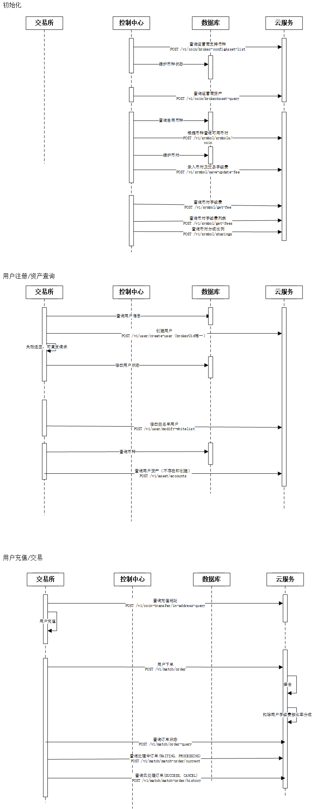
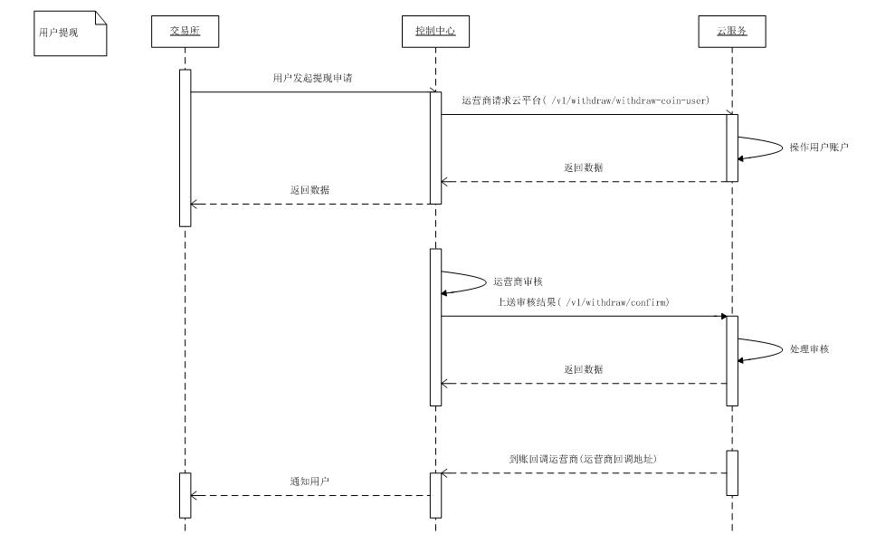
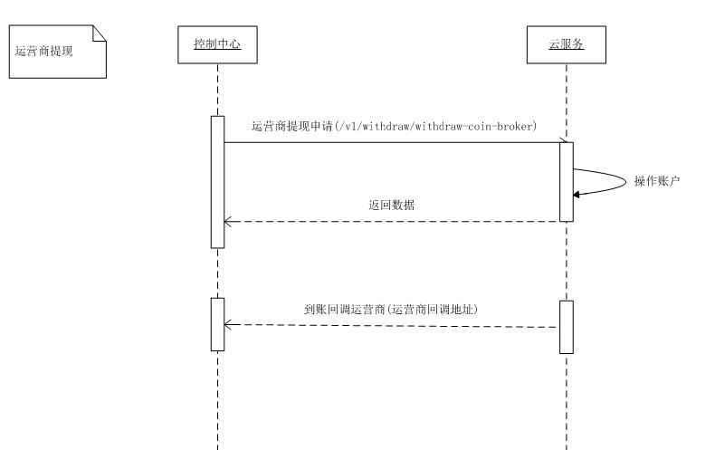

# MasterDAX运营商服务端接入手册_V1.0
--------------------
MasterDAX做为服务商，给所有运营商的交易所提供交易所用户挂单及撮合，用户资产及充值提现等服务。同时做为交易所的运营商，我们会将您的手续费的盈利T+0结算到账户中，随时可以完成资产转出。

## 1.简介
MasterDAX做为交易所云服务提供商，给运营商及运营商的用户提供以下服务：

| 角色 | 提供的服务 | 备注 |
| :---- | :----- | :----- |
| 运营商用户 |用户的充值、币币交易、提现等主要功能 | |
| 运营商 | 用户币币交易产生的手续费、提现手续费T+0结算到运营商账户 | |


### 1.1 接入准备
与MasterDAX签订合同后，我们会给您生成唯一标识的运营商ID `brokerId` , 同时也会生成对应的 `APIkey` , `APIsercretkey` 做签名验签使用。请在接入前提供以下信息：</br>

-  回调地址</br>
-  绑定的IP，最多支持5个IP

### 1.2 交易流程说明
#### 1.2.1 运营商用户交易流程
按文档提供的接口接入后，可以完成用户在交易所下单，撤单等操作，具体流程如图：





#### 1.2.2 运营商结算流程
运营商用户一旦在交易所产生手续费（交易手续费和提现手续费）时，MasterDAX会根据约定将运营商的手续费收益T+0实时结算至运营商在MasterDAX开立的账户中，运营商可自行通过接口发起转出操作，转出至运营商自己的地址中。具体流程如图：



### 1.3 请求交互
#### 1.3.1 URI scheme
*Host* : ip:8080  
*BasePath* : /api

#### 1.3.2 请求交互说明
1. 提交方式
    
    将封装好的请求参数转换为`JSON 格式`通过POST方式提交至服务器。

2. 服务器响应

    服务器首先对用户请求数据进行参数安全校验，通过校验后根据业务逻辑将响应数据以`JSON 格式` 响应给客户

<a name="signature"></a>

#### 1.3.3 签名方式

1. 将`Body`数据与`secretKey`私钥拼接，拼接不加任何字符
2. 进行sha256加密；转成HEX大写字符串

```
private String generateSign(String json, String secretKey) {
    String payload = json + secretKey;
    log.debug("payload：" + payload);
    return DigestUtils.sha256Hex(payload).toUpperCase();
}
```

## 2.交易所标准接口
### 2.1 币种及币对配置
> 接入前请先查询交易所支持的交易币种和交易币对，只有支持的币种及币对MasterDAX才会提供相关的交易服务。如有疑问可与商务人员沟通。

#### 2.1.1 运营商币种列表查询
查询所有交易所支持的币种
> 请求方式：POST
</BR>
> 接口名：[/v1/coin/broker-configAsset-list](#brokerassetlistusingpost)

#### 2.1.2 运营商币对列表查询
查询所有交易所支持的交易币对，根据交易币种查询币对
> 请求方式：POST</br>
> 接口名：[/v1/symbol/symbols/coin](#getsymbolsbycoinusingpost)

#### 2.1.3 运营商币对及手续费录入
运营商交易所的币种对，如`EOS/BTC`,需要先在MasterDAX录入后才能获取深度及K线等数据。</br>
**注意**：手续费由运营商维护，MasterDAX会在交易撮合请求时根据此字段计算用户手续费。
> 请求方式：POST</br>
> 接口名：[/v1/symbol/save-update-fee](#addfeeusingpost)


#### 2.1.4 运营商录入手续费查询
##### 2.1.4.1 单个币对查询
> 请求方式：POST</br>
> 接口名：[/v1/symbol/get-fee](#getfeeusingpost)


##### 2.1.4.2 所有币对列表查询

> 请求方式：POST</br>
> 接口名：[/v1/symbol/get-fees](#getfeeusingpost_1)


### 2.2 用户资产
#### 2.2.1 创建用户
运营商的用户注册完成后需要将用户的`uid`同步给MasterDAX，以便用户可以完成后续的充值，交易等操作。
> 请求方式：POST</br>
> 接口名： [/v1/user/create-user](#createuserusingpost)

#### 2.2.2 修改白名单用户
运营商可对某个用户设置白名单，白名单的用户交易手续费为0。
> 请求方式：POST</br>
> 接口名： [/v1/user/modify-whitelist](#modifywhitelistusingpost)


#### 2.2.2 用户资产查询
支持查询用户的所有资产数量，包括可用余额，冻结余额。
> 请求方式：POST</br>
> 接口名： [/v1/asset/accounts](#getuseraccountassetsusingpost)


### 2.3 用户充值
#### 2.3.1 获取用户充值地址
用户点击充值时可调用此接口获取充值地址，用户之前若没有充值地址系统会自动分配一个。
> 请求方式：POST</br>
> 接口名： [/v1/coin-transfer/in-address-query](#getcointransferinaddressusingpost)


#### 2.3.2 用户充值回调
用户充值到账后回调运营商提供的回调地址，通知运营商充值到账
> 请求方式：POST</br>
> 接口名： [DepositCallBack](#depositCallBack)


#### 2.3.3 充值记录查询
支持查询单个用户和所有用的充值记录。
> 请求方式：POST</br>
> 接口名： [/v1/deposit/deposit-coin-details](#getdepositcoinusingpost)

    
### 2.4 Exchange交易
#### 2.4.1 市场深度查询
支持查询MasterDAX的所有深度数据。
> 请求方式：GET</br>
> 接口名： [/trade/trade?symbol=symbolCode](#getdepthendpoint)


#### 2.4.2 获取K线
支持查询MasterDAX的所有K线数据。
> 请求方式：POST</br>币对
> 接口名： [/v1/data/kline/kline-pages](#getklinepagesusingpost)


#### 2.4.3 获取历史交易
支持按币对查询MasterDAX的成交历史交易记录。
> 请求方式：POST</br>
> 接口名： [/trade/info?symbol=BTC_EOS](#gettradedendpoint)


#### 2.4.4 24H数据查询
支持某币对的最新成交价、24H涨跌幅、24H最高价、24H最低价、24H成交量等数据。
> 请求方式：GET</br>
> 接口名： [/trade/detail](#ettradedetail)


#### 2.4.5 用户交易挂单
用户在某币对的挂单请求发送到MasterDAX处理。
> 请求方式：POST</br>
> 接口名： [/v1/match/order](#matchorderusingpost)


#### 2.4.6 用户交易撤单
用户在某币对的撤单请求发送到MasterDAX处理。
> 请求方式：POST</br>
> 接口名： [/v1/match/match-order/cancel](#cancelmatchorderusingpost)


#### 2.4.7 用户单笔订单状态查询
根据订单号查询用户在某币对的挂单状态等信息。
> 请求方式：POST</br>
> 接口名：  [/v1/match/order-query](#orderqueryusingpost)


#### 2.4.8 用户进行中订单列表查询
查询用户在某币对挂单，状态为`waiting` 和 `pending` 的订单分页列表。
> 请求方式：POST</br>
> 接口名： [/v1/match/match-order/current](#getmatchorderdetailusingpost)

#### 2.4.9 用户已处理订单查询
查询用户在某币对挂单，状态为`success` 和 `cancel` 的订单分页列表。
> 请求方式：POST</br>
> 接口名：  [/v1/match/match-order/history](#gethistorymatchorderusingpost)


#### 2.4.10 所有用户交易记录查询
查询所有用户在某币对挂单的交易订单分页列表。
> 请求方式：POST</br>
> 接口名：  [/v1/trade/userTradeRecord](#getusertraderecordusingpost)


### 2.5 用户提现
#### 2.5.1 用户提现申请
用户发起提现操作时调用此接口扣除用户对应资产。
> 请求方式：POST</br>
> 接口名：  [/v1/withdraw/withdraw-coin-user](#userwithdrawcoinusingpost)


#### 2.5.2 用户可提现金额查询
用户发起提现操作时调用此接口查询当前可提现的余额数量。
> 请求方式：POST</br>
> 接口名：  [/v1/withdraw/query-balance](#querybalanceusingpost)


#### 2.5.3 提现未处理数量查询
用户发起的提现申请如果需要在运营商后台进行审核，可查询该接口获取某币种的提现申请未处理的数量。

> 请求方式：POST</br>
> 接口名：  [/v1/withdraw/unverifiedCount](#queryunverifiedcountusingpost)


#### 2.5.4 用户提现审核处理
用户发起的提现申请如果在运营商后台通过审核，可调用此接口。上送的审核状态为 ` 通过 ` 时会做提现操作并回调给运营商，若上送的审核状态为 ` 拒绝 `，系统会将扣除用户的币退还到用户资产中。

> 请求方式：POST</br>
> 接口名：  [/v1/withdraw/confirm](#confirmusingpost)


#### 2.5.5 用户已提现总数查询
用户发起的提现总数。

> 请求方式：POST</br>
> 接口名：  [/v1/withdraw/queryWithdrawTotal](#querywithdrawtotalusingpost)


#### 2.5.6 用户提现记录查询
查询用户发起的提现记录，可按 `UID` 和 `status` 查询。`UID` 为 `NULL`时显示所有的用户提现记录。
 

> 请求方式：POST</br>
> 接口名：  [/v1/withdraw/withdraw-coin-details](#getwithdrawcoinusingpost)

#### 2.5.7 用户提现回调
用户提现到账或提现触发限额后审核失败回调通知运营商

> 请求方式：POST</br>
> 接口名： [WithdrawCallBack](#withdrawCallBack)


## 3.运营商结算接口
用户交易产生的手续费，系统会在 `T+0` 实时结算给运营商，运营商可以在结算账户中查询并按情况做转出操作。

### 3.1 结算账户资产查询
查询运营商的结算账户的资产总数，用户交易产生的手续费、提现的手续费会进入结算账户中。
 

> 请求方式：POST</br>
> 接口名：  [/v1/coin/brokerAsset-query](#querybrokerfinanceusingpost)


### 3.2 结算账户资产转出申请
结算账户的资产可申请转出至运营商自己的地址。
 

> 请求方式：POST</br>
> 接口名：  [/v1/withdraw/withdraw-coin-broker](#brokerwithdrawcoinusingpost)


### 3.3 结算账户资产转出状态回调
结算账户的资产转出申请成功后，系统会将转出的状态回调给运营商，状态有 `到账` 和 `拒绝`。
> 请求方式：POST</br>
> 接口名： [WithdrawCallBack](#withdrawCallBack)


### 3.4 结算账户资产转出记录查询
查询该结算账户下资产转出的记录，输入的`UID=0`时查询的是运营商的转出记录。
 

> 请求方式：POST</br>
> 接口名：  [/v1/withdraw/withdraw-coin-details](#getwithdrawcoinusingpost)


### 3.5 币对分成比例查询
用户交易产生的手续费与MasterDAX的分成比例查询。
 

> 请求方式：POST</br>
> 接口名：  [/v1/symbol/sharings](#getsharingusingpost)


### 3.6 结算订单记录查询
查询用户交易和提现产生的手续费结算记录。
 

> 请求方式：POST</br>
> 接口名：  [/v1/settle/settle-record](#querysettlerecordusingpost)


## 4.错误码

|code|msg|
|---|---|
|**SUCCESS**|成功|//成功
|**FAIL**|系统异常|//成功
|**PARAM_ERROR**|参数错误|  //参数错误
|**SIGN_ERROR**|签名错误|
|**DUPLICATE_DATA**|数据重复|
|**EMPTY_RECORD**|记录为空|
|**TOO_MANY_RECORDS**|记录过多|
|**REPEAT_MESSAGE**|重复的消息|  //重复的消息
|**USER_NOT_EXIST**|用户信息不存在|
|**BROKER_ASSET_NOT_EXIST**|运营商没有分配该币种|
|**BROKER_ASSET_EXIST**|运营商已经分配该币种|
|**SYMBOL_FORMAT_ERROR**|币对格式错误|
|**INVALID_SYMBOL**|币对未生效|
|**ORDER_CREATE_ERROR**|订单创建失败|
|**ORDER_NOT_EXIST**|订单信息不存在|
|**ORDER_STATE_ERROR**|订单状态错误|
|**ORDER_HAD_CANCELLED**|订单已撤销|
|**ORDER_HAD_PROCESSING**|订单处理中|
|**ORDER_HAD_TRADED**|订单已撮合|
|**NO_PERMISSION**|没有权限|  //没有权限
|**BROKER_NOT_EXIST**|运营商未入驻|
|**ADDRESS_ASSIGN_ERROR**|生成地址出错|
|**MESSAGE_TO_MQ_FAIL**|发送消息到mq失败|
|**ADDRESS_STATUS_ERROR**|地址状态错误|
|**ACCOUNT_STATUS_ERROR**|账号状态异常|
|**WITHDRAW_FEE_TOO_LOW**|提现手续费小于平台手续费|
|**WITHDRAW_TOO_LOW**|提现金额小于平台手续费|
|**COIN_ASSERT_LESS**|可用资金余额不足|
|**COIN_LOCK_ASSERT_LESS**|锁定资金余额不足|
|**ADDRESS_DELETE_ERROR**|删除地址错误|
|**WITHDRAW_ORDER_STAUTS_ERROR**|提现订单状态异常|
|**WITHDRAW_ORDER_STAUTS_UPDATE_ERROR**|提现订单状态更新异常|
|**DEPOSIT_ORDER_STAUTS_ERROR**|充值订单状态异常|
|**DEPOSIT_ORDER_NOT_EXIST**|充值订单不存在|
|**COIN_DEPOSIT_ADDRESS_INVALID**|充值地址不存在|
|**DEPOSIT_ORDER_INSERT_ERROR**|充值订单新增异常|
|**DEPOSIT_ORDER_STAUTS_UPDATE_ERROR**|充值订单状态更新异常|
|**USER_TOTAL_LIMIT**|用户注册总数超限|
|**WITHDRAW_ASSETCODE_NOT_SUPPORT**|提现币种未配置|
|**UPDATE_FINANCE_ERROR**|更新资产失败|
|**BATCH_INSERT_FINANCEDETAIL_ERROR**|批量更新资产失败|

# cloud-exchange-api

<a name="paths"></a>
## PUBLIC

<a name="getdepthendpoint"></a>
### Depth
```
GET `/trade/trade?symbol=`symbolCode
```

#### Parameters

|参数名|   参数类型|   必填| 描述|
| :-----    | :-----   | :-----    | :-----   |
|symbolCode|String|是|币对（填充到URL路径中）|


#### Responses example

```
{
    "sell": [
        [
            0.00002736, 
            1071.36299794
        ], 
        [
            0.00002738, 
            0.19978522
        ], 
        [
            0.00002742, 
            75.9087355
        ]
    ], 
    "buy": [
        [
            0.00002618, 
            16.33033728
        ], 
        [
            0.00002611, 
            605.26813127
        ], 
        [
            0.0000261, 
            499.81630013
        ]
    ]
}
```

<a name="gettradedetail"></a>
### 24HOURS
```
GET /trade/detail
```
   
#### Responses example

```
{
  "BTC_TRX": {
    "24high": "",
    "24low": "",
    "24Total": "",
    "24Price": ""
  },
  "BTC_KCASH": {
    "24high": "",
    "24low": "",
    "24Total": "",
    "24Price": ""
  },
  "BTC_STORJ": {
    "24high": "0.00006868000000000000",
    "24low": "0.00006615000000000000",
    "24Total": "7046.20000000000000000000",
    "newPrice": 6.807e-05,
    "24Price": "0.00006766000000000000"
  }
}
```

<a name="gettradedendpoint"></a>
### TRADED ORDER
```
GET /trade/info?symbol=BTC_EOS
```

#### Parameters

|参数名|   参数类型|   必填| 描述|
| :-----    | :-----   | :-----    | :-----   |
|symbol|String|是|币对（填充到URL路径中）|

#### Responses example

```
{
    "24high": "0.00129310000000000000", 
    "24low": "0.00087410000000000000", 
    "24Total": "95162.53042596000000000000", 
    "order": [
        {
            "time": "1523503566", 
            "type": "SELL", 
            "num": 9.15, 
            "price": 0.0012772
        }, 
        {
            "time": "1523503506", 
            "type": "BUY", 
            "num": 2.3165, 
            "price": 0.00128
        }
    ], 
    "24Price": "0.00087520000000000000"
}
```

<a name="paths"></a>
## PRIVATE

<a name="getuseraccountassetsusingpost"></a>
### 用户资产查询(以运营商支持且分配给用户币种列表为基础)
```
POST /v1/asset/accounts
```


#### Parameters

|Type|Name|Description|Schema|
|---|---|---|---|
|**Header**|**accessKey**  <br>*required*|访问秘钥|string|
|**Header**|**sign**  <br>*required*|签名|string|
|**Body**|**request**  <br>*required*|request|[BrokerAssetAccountRequest](#brokerassetaccountrequest)|


#### Responses

|HTTP Code|Description|Schema|
|---|---|---|
|**200**|OK|[ApiResponse«List«AssetDto»»](#d26b592b71e05154ee6b33c6f7a261cc)|
|**201**|Created|No Content|
|**401**|Unauthorized|No Content|
|**403**|Forbidden|No Content|
|**404**|Not Found|No Content|


#### Consumes

* `application/json`


#### Produces

* `\*/*`


#### Tags

* user-asset-controller


<a name="getcointransferinaddressusingpost"></a>
### 获取用户充值地址
```
POST /v1/coin-transfer/in-address-query
```


#### Parameters

|Type|Name|Description|Schema|
|---|---|---|---|
|**Header**|**accessKey**  <br>*required*|访问秘钥|string|
|**Header**|**sign**  <br>*required*|签名|string|
|**Body**|**assetRequest**  <br>*required*|assetRequest|[AssetRequest](#assetrequest)|


#### Responses

|HTTP Code|Description|Schema|
|---|---|---|
|**200**|OK|[ApiResponse«List«TransferInAddressDto»»](#ed7ed4b8e03e4b9a2ee44094fecf6ffd)|
|**201**|Created|No Content|
|**401**|Unauthorized|No Content|
|**403**|Forbidden|No Content|
|**404**|Not Found|No Content|


#### Consumes

* `application/json`


#### Produces

* `\*/*`


#### Tags

* coin-address-man-controller

<a name="depositCallBack"></a>
### 充值回调

#### Parameters

|Type|Name|Description|Schema|
|---|---|---|---|
|**Header**|**accessKey**  <br>*required*|访问秘钥|string|
|**Header**|**sign**  <br>*required*|签名|string|
|**Body**|**DepositApiResponseDto**  <br>*required*|DepositApiResponseDto|[DepositApiResponseDto](#DepositApiResponseDto)|


#### Responses

|HTTP Code|Description|Schema|
|---|---|---|
|**200**|OK|

#### Consumes

* `application/json`


#### Produces

* `\*/*`


#### Tags

<a name="brokerassetlistusingpost"></a>
### 运营商币种列表查询（包含提现手续费）
```
POST /v1/coin/broker-configAsset-list
```


#### Parameters

|Type|Name|Description|Schema|
|---|---|---|---|
|**Header**|**accessKey**  <br>*required*|访问秘钥|string|
|**Header**|**sign**  <br>*required*|签名|string|
|**Body**|**request**  <br>*required*|request|[BrokerAssetRequest](#brokerassetrequest)|


#### Responses

|HTTP Code|Description|Schema|
|---|---|---|
|**200**|OK|[ApiResponse«List«BrokerConfigAssetDto»»](#29d3eb9515674d5e992cf7c3fcea8a5b)|
|**201**|Created|No Content|
|**401**|Unauthorized|No Content|
|**403**|Forbidden|No Content|
|**404**|Not Found|No Content|


#### Consumes

* `application/json`


#### Produces

* `\*/*`


#### Tags

* asset-manager-controller


<a name="querybrokerfinanceusingpost"></a>
### 运营商结算账户资产查询
```
POST /v1/coin/brokerAsset-query
```


#### Parameters

|Type|Name|Description|Schema|
|---|---|---|---|
|**Header**|**accessKey**  <br>*required*|访问秘钥|string|
|**Header**|**sign**  <br>*required*|签名|string|
|**Body**|**request**  <br>*required*|request|[PageRequest](#pagerequest)|


#### Responses

|HTTP Code|Description|Schema|
|---|---|---|
|**200**|OK|[ApiResponse«BrokerPageModel«BrokerAssetDto»»](#3129640bc337647a01d923c78ac55f72)|
|**201**|Created|No Content|
|**401**|Unauthorized|No Content|
|**403**|Forbidden|No Content|
|**404**|Not Found|No Content|


#### Consumes

* `application/json`


#### Produces

* `\*/*`


#### Tags

* asset-manager-controller


<a name="getklinepagesusingpost"></a>
### 获取K线（分页查询）
```
POST /v1/data/kline/kline-pages
```


#### Parameters

|Type|Name|Description|Schema|
|---|---|---|---|
|**Header**|**accessKey**  <br>*required*|访问秘钥|string|
|**Header**|**sign**  <br>*required*|签名|string|
|**Body**|**req**  <br>*required*|req|[KlineQueryReq](#klinequeryreq)|


#### Responses

|HTTP Code|Description|Schema|
|---|---|---|
|**200**|OK|[ApiResponse«KlineQueryPages»](#8710d779824389ca515611e3c22f2f66)|
|**201**|Created|No Content|
|**401**|Unauthorized|No Content|
|**403**|Forbidden|No Content|
|**404**|Not Found|No Content|


#### Consumes

* `application/json`


#### Produces

* `\*/*`


#### Tags

* kline-query-controller


<a name="getdepositcoinusingpost"></a>
### 运营商用户充值记录查询
```
POST /v1/deposit/deposit-coin-details
```


#### Parameters

|Type|Name|Description|Schema|
|---|---|---|---|
|**Header**|**accessKey**  <br>*required*|访问秘钥|string|
|**Header**|**sign**  <br>*required*|签名|string|
|**Body**|**request**  <br>*required*|request|[DepositQueryRequest](#depositqueryrequest)|


#### Responses

|HTTP Code|Description|Schema|
|---|---|---|
|**200**|OK|[ApiResponse«PageModel«DepositDetailDto»»](#82c577a03b8be584493954e6197f9b45)|
|**201**|Created|No Content|
|**401**|Unauthorized|No Content|
|**403**|Forbidden|No Content|
|**404**|Not Found|No Content|


#### Consumes

* `application/json`


#### Produces

* `\*/*`


#### Tags

* deposit-coin-controller


<a name="cancelmatchorderusingpost"></a>
### 用户交易撤单
```
POST /v1/match/match-order/cancel
```


#### Parameters

|Type|Name|Description|Schema|
|---|---|---|---|
|**Header**|**accessKey**  <br>*required*|访问秘钥|string|
|**Header**|**sign**  <br>*required*|签名|string|
|**Body**|**req**  <br>*required*|req|[CancelOrderReq](#cancelorderreq)|


#### Responses

|HTTP Code|Description|Schema|
|---|---|---|
|**200**|OK|[ApiResponse«Void»](#196cc3be9a21471c8e871b4fb9019cae)|
|**201**|Created|No Content|
|**401**|Unauthorized|No Content|
|**403**|Forbidden|No Content|
|**404**|Not Found|No Content|


#### Consumes

* `application/json`


#### Produces

* `\*/*`


#### Tags

* match-order-controller


<a name="getmatchorderdetailusingpost"></a>
### 用户进行中订单列表查询
```
POST /v1/match/match-order/current
```


#### Parameters

|Type|Name|Description|Schema|
|---|---|---|---|
|**Header**|**accessKey**  <br>*required*|访问秘钥|string|
|**Header**|**sign**  <br>*required*|签名|string|
|**Body**|**req**  <br>*required*|req|[MatchOrderPageQueryReq](#matchorderpagequeryreq)|


#### Responses

|HTTP Code|Description|Schema|
|---|---|---|
|**200**|OK|[ApiResponse«PageInfo«MatchOrderDetail»»](#af561c25b8a6a1a5325d4e5de5fcefa2)|
|**201**|Created|No Content|
|**401**|Unauthorized|No Content|
|**403**|Forbidden|No Content|
|**404**|Not Found|No Content|


#### Consumes

* `application/json`


#### Produces

* `\*/*`


#### Tags

* match-order-controller


<a name="gethistorymatchorderusingpost"></a>
### 用户已处理订单查询
```
POST /v1/match/match-order/history
```


#### Parameters

|Type|Name|Description|Schema|
|---|---|---|---|
|**Header**|**accessKey**  <br>*required*|访问秘钥|string|
|**Header**|**sign**  <br>*required*|签名|string|
|**Body**|**req**  <br>*required*|req|[MatchOrderPageQueryReq](#matchorderpagequeryreq)|


#### Responses

|HTTP Code|Description|Schema|
|---|---|---|
|**200**|OK|[ApiResponse«PageInfo«MatchOrderDetail»»](#af561c25b8a6a1a5325d4e5de5fcefa2)|
|**201**|Created|No Content|
|**401**|Unauthorized|No Content|
|**403**|Forbidden|No Content|
|**404**|Not Found|No Content|


#### Consumes

* `application/json`


#### Produces

* `\*/*`


#### Tags

* match-order-controller


<a name="matchorderusingpost"></a>
### 用户交易挂单
```
POST /v1/match/order
```


#### Parameters

|Type|Name|Description|Schema|
|---|---|---|---|
|**Header**|**accessKey**  <br>*required*|访问秘钥|string|
|**Header**|**sign**  <br>*required*|签名|string|
|**Body**|**req**  <br>*required*|req|[MatchOrderReq](#matchorderreq)|


#### Responses

|HTTP Code|Description|Schema|
|---|---|---|
|**200**|OK|[ApiResponse«Void»](#196cc3be9a21471c8e871b4fb9019cae)|
|**201**|Created|No Content|
|**401**|Unauthorized|No Content|
|**403**|Forbidden|No Content|
|**404**|Not Found|No Content|


#### Consumes

* `application/json`


#### Produces

* `\*/*`


#### Tags

* match-order-controller


<a name="orderqueryusingpost"></a>
### 用户单笔订单状态查询
```
POST /v1/match/order-query
```


#### Parameters

|Type|Name|Description|Schema|
|---|---|---|---|
|**Header**|**accessKey**  <br>*required*|访问秘钥|string|
|**Header**|**sign**  <br>*required*|签名|string|
|**Body**|**req**  <br>*required*|req|[QueryOrderReq](#queryorderreq)|


#### Responses

|HTTP Code|Description|Schema|
|---|---|---|
|**200**|OK|[MatchOrderDetail](#matchorderdetail)|
|**201**|Created|No Content|
|**401**|Unauthorized|No Content|
|**403**|Forbidden|No Content|
|**404**|Not Found|No Content|


#### Consumes

* `application/json`


#### Produces

* `\*/*`


#### Tags

* match-order-controller


<a name="querysettlerecordusingpost"></a>
### 运营商结算订单记录查询
```
POST /v1/settle/settle-record
```


#### Parameters

|Type|Name|Description|Schema|
|---|---|---|---|
|**Header**|**accessKey**  <br>*required*|访问秘钥|string|
|**Header**|**sign**  <br>*required*|签名|string|
|**Body**|**request**  <br>*required*|request|[SettleQueryRequest](#settlequeryrequest)|


#### Responses

|HTTP Code|Description|Schema|
|---|---|---|
|**200**|OK|[ApiResponse«PageModel«SettleRecordDto»»](#29fbac2cdffd95d8715e7846d92debdd)|
|**201**|Created|No Content|
|**401**|Unauthorized|No Content|
|**403**|Forbidden|No Content|
|**404**|Not Found|No Content|


#### Consumes

* `application/json`


#### Produces

* `\*/*`


#### Tags

* settle-manager-controller


<a name="getfeeusingpost"></a>
### 查询单个币对
```
POST /v1/symbol/get-fee
```


#### Parameters

|Type|Name|Description|Schema|
|---|---|---|---|
|**Header**|**accessKey**  <br>*required*|访问秘钥|string|
|**Header**|**sign**  <br>*required*|签名|string|
|**Body**|**req**  <br>*required*|req|[SymbolFeeQueryReq](#symbolfeequeryreq)|


#### Responses

|HTTP Code|Description|Schema|
|---|---|---|
|**200**|OK|[ApiResponse«BrokerSymbolFeeData»](#b51c21747b9194b617a696eca5e3e0b7)|
|**201**|Created|No Content|
|**401**|Unauthorized|No Content|
|**403**|Forbidden|No Content|
|**404**|Not Found|No Content|


#### Consumes

* `application/json`


#### Produces

* `\*/*`


#### Tags

* symbol-controller


<a name="getfeeusingpost_1"></a>
### 查询所有币对列表
```
POST /v1/symbol/get-fees
```


#### Parameters

|Type|Name|Description|Schema|
|---|---|---|---|
|**Header**|**accessKey**  <br>*required*|访问秘钥|string|
|**Header**|**sign**  <br>*required*|签名|string|
|**Body**|**req**  <br>*required*|req|[SymbolFeeListQueryReq](#symbolfeelistqueryreq)|


#### Responses

|HTTP Code|Description|Schema|
|---|---|---|
|**200**|OK|[ApiResponse«List«BrokerSymbolFeeData»»](#eaeff6f989d4756651fba9d76ad90043)|
|**201**|Created|No Content|
|**401**|Unauthorized|No Content|
|**403**|Forbidden|No Content|
|**404**|Not Found|No Content|


#### Consumes

* `application/json`


#### Produces

* `\*/*`


#### Tags

* symbol-controller


<a name="addfeeusingpost"></a>
### 录入币对及手续费
```
POST /v1/symbol/save-update-fee
```


#### Parameters

|Type|Name|Description|Schema|
|---|---|---|---|
|**Header**|**accessKey**  <br>*required*|访问秘钥|string|
|**Header**|**sign**  <br>*required*|签名|string|
|**Body**|**req**  <br>*required*|req|[SymbolFeeAddReq](#symbolfeeaddreq)|


#### Responses

|HTTP Code|Description|Schema|
|---|---|---|
|**200**|OK|[ApiResponse«BrokerSymbolFeeData»](#b51c21747b9194b617a696eca5e3e0b7)|
|**201**|Created|No Content|
|**401**|Unauthorized|No Content|
|**403**|Forbidden|No Content|
|**404**|Not Found|No Content|


#### Consumes

* `application/json`


#### Produces

* `\*/*`


#### Tags

* symbol-controller


<a name="getsharingusingpost"></a>
### 币对分成比例查询
```
POST /v1/symbol/sharings
```


#### Parameters

|Type|Name|Description|Schema|
|---|---|---|---|
|**Header**|**accessKey**  <br>*required*|访问秘钥|string|
|**Header**|**sign**  <br>*required*|签名|string|
|**Query**|**nanoTime**  <br>*required*|当前时间戳(纳秒)|integer (int64)|


#### Responses

|HTTP Code|Description|Schema|
|---|---|---|
|**200**|OK|[ApiResponse«SymbolSharingData»](#ceae0169df711b82935661c7d4227567)|
|**201**|Created|No Content|
|**401**|Unauthorized|No Content|
|**403**|Forbidden|No Content|
|**404**|Not Found|No Content|


#### Consumes

* `application/json`


#### Produces

* `\*/*`


#### Tags

* symbol-controller


<a name="getsymbolsbycoinusingpost"></a>
### 根据币种查询币对列表
```
POST /v1/symbol/symbols/coin
```


#### Parameters

|Type|Name|Description|Schema|
|---|---|---|---|
|**Header**|**accessKey**  <br>*required*|访问秘钥|string|
|**Header**|**sign**  <br>*required*|签名|string|
|**Body**|**req**  <br>*required*|req|[SymbolQueryReq](#symbolqueryreq)|


#### Responses

|HTTP Code|Description|Schema|
|---|---|---|
|**200**|OK|[ApiResponse«List«SymbolData»»](#b01ba55e3561c1ba9febd8ca5bc3539b)|
|**201**|Created|No Content|
|**401**|Unauthorized|No Content|
|**403**|Forbidden|No Content|
|**404**|Not Found|No Content|


#### Consumes

* `application/json`


#### Produces

* `\*/*`


#### Tags

* symbol-controller


<a name="getusertraderecordusingpost"></a>
### 运营商用户交易记录查询
```
POST /v1/trade/userTradeRecord
```


#### Parameters

|Type|Name|Description|Schema|
|---|---|---|---|
|**Header**|**accessKey**  <br>*required*|访问秘钥|string|
|**Header**|**sign**  <br>*required*|签名|string|
|**Body**|**request**  <br>*required*|request|[TradeOrderQueryRequest](#tradeorderqueryrequest)|


#### Responses

|HTTP Code|Description|Schema|
|---|---|---|
|**200**|OK|[ApiResponse«PageModel«TradeOrderDto»»](#fb7634128e52b8535dc169001707afec)|
|**201**|Created|No Content|
|**401**|Unauthorized|No Content|
|**403**|Forbidden|No Content|
|**404**|Not Found|No Content|


#### Consumes

* `application/json`


#### Produces

* `\*/*`


#### Tags

* trade-manager-controller


<a name="createuserusingpost"></a>
### 创建用户
```
POST /v1/user/create-user
```


#### Parameters

|Type|Name|Description|Schema|
|---|---|---|---|
|**Header**|**accessKey**  <br>*required*|访问秘钥|string|
|**Header**|**sign**  <br>*required*|签名|string|
|**Body**|**req**  <br>*required*|req|[CreateUserReq](#createuserreq)|


#### Responses

|HTTP Code|Description|Schema|
|---|---|---|
|**200**|OK|[ApiResponse«UserData»](#7d001d219a176986c8b2752c3f4d05d3)|
|**201**|Created|No Content|
|**401**|Unauthorized|No Content|
|**403**|Forbidden|No Content|
|**404**|Not Found|No Content|


#### Consumes

* `application/json`


#### Produces

* `\*/*`


#### Tags

* user-controller


<a name="modifywhitelistusingpost"></a>
### 修改白名单用户
```
POST /v1/user/modify-whitelist
```


#### Parameters

|Type|Name|Description|Schema|
|---|---|---|---|
|**Header**|**accessKey**  <br>*required*|访问秘钥|string|
|**Header**|**sign**  <br>*required*|签名|string|
|**Body**|**req**  <br>*required*|req|[ModifyWhitelistReq](#modifywhitelistreq)|


#### Responses

|HTTP Code|Description|Schema|
|---|---|---|
|**200**|OK|[ApiResponse«Void»](#196cc3be9a21471c8e871b4fb9019cae)|
|**201**|Created|No Content|
|**401**|Unauthorized|No Content|
|**403**|Forbidden|No Content|
|**404**|Not Found|No Content|


#### Consumes

* `application/json`


#### Produces

* `\*/*`


#### Tags

* user-controller


<a name="confirmusingpost"></a>
### 运营商用户提现审核处理
```
POST /v1/withdraw/confirm
```


#### Parameters

|Type|Name|Description|Schema|
|---|---|---|---|
|**Header**|**accessKey**  <br>*required*|访问秘钥|string|
|**Header**|**sign**  <br>*required*|签名|string|
|**Body**|**request**  <br>*required*|request|[WithdrawConfirmRequest](#withdrawconfirmrequest)|


#### Responses

|HTTP Code|Description|Schema|
|---|---|---|
|**200**|OK|[ApiResponse«Void»](#196cc3be9a21471c8e871b4fb9019cae)|
|**201**|Created|No Content|
|**401**|Unauthorized|No Content|
|**403**|Forbidden|No Content|
|**404**|Not Found|No Content|


#### Consumes

* `application/json`


#### Produces

* `\*/*`


#### Tags

* withdraw-coin-controller


<a name="querybalanceusingpost"></a>
### 查询可提现金额
```
POST /v1/withdraw/query-balance
```


#### Parameters

|Type|Name|Description|Schema|
|---|---|---|---|
|**Header**|**accessKey**  <br>*required*|访问秘钥|string|
|**Header**|**sign**  <br>*required*|签名|string|
|**Body**|**assetRequest**  <br>*required*|assetRequest|[AssetRequest](#assetrequest)|


#### Responses

|HTTP Code|Description|Schema|
|---|---|---|
|**200**|OK|[ApiResponse«bigdecimal»](#62e4a694d927f3a9133cf1942a9a9102)|
|**201**|Created|No Content|
|**401**|Unauthorized|No Content|
|**403**|Forbidden|No Content|
|**404**|Not Found|No Content|


#### Consumes

* `application/json`


#### Produces

* `\*/*`


#### Tags

* withdraw-coin-controller


<a name="querywithdrawtotalusingpost"></a>
### 已提现总数
```
POST /v1/withdraw/queryWithdrawTotal
```


#### Parameters

|Type|Name|Description|Schema|
|---|---|---|---|
|**Header**|**accessKey**  <br>*required*|访问秘钥|string|
|**Header**|**sign**  <br>*required*|签名|string|
|**Body**|**request**  <br>*required*|request|[WithdrawTotalAmountRequest](#withdrawtotalamountrequest)|


#### Responses

|HTTP Code|Description|Schema|
|---|---|---|
|**200**|OK|[ApiResponse«Map«string,bigdecimal»»](#71933e463130fcc6486fb5fb5f34c23e)|
|**201**|Created|No Content|
|**401**|Unauthorized|No Content|
|**403**|Forbidden|No Content|
|**404**|Not Found|No Content|


#### Consumes

* `application/json`


#### Produces

* `\*/*`


#### Tags

* withdraw-coin-controller


<a name="queryunverifiedcountusingpost"></a>
### 单币种提现未处理数量
```
POST /v1/withdraw/unverifiedCount
```


#### Parameters

|Type|Name|Description|Schema|
|---|---|---|---|
|**Header**|**accessKey**  <br>*required*|访问秘钥|string|
|**Header**|**sign**  <br>*required*|签名|string|
|**Body**|**request**  <br>*required*|request|[UnVerifiedCountRequest](#unverifiedcountrequest)|


#### Responses

|HTTP Code|Description|Schema|
|---|---|---|
|**200**|OK|[ApiResponse«Map«string,int»»](#3a2cb5618d3fe80bff232572e56c295a)|
|**201**|Created|No Content|
|**401**|Unauthorized|No Content|
|**403**|Forbidden|No Content|
|**404**|Not Found|No Content|


#### Consumes

* `application/json`


#### Produces

* `\*/*`


#### Tags

* withdraw-coin-controller


<a name="brokerwithdrawcoinusingpost"></a>
### 运营商资产转出申请
```
POST /v1/withdraw/withdraw-coin-broker
```


#### Parameters

|Type|Name|Description|Schema|
|---|---|---|---|
|**Header**|**accessKey**  <br>*required*|访问秘钥|string|
|**Header**|**sign**  <br>*required*|签名|string|
|**Body**|**request**  <br>*required*|request|[BrokerWithdrawRequest](#brokerwithdrawrequest)|


#### Responses

|HTTP Code|Description|Schema|
|---|---|---|
|**200**|OK|[ApiResponse«Void»](#196cc3be9a21471c8e871b4fb9019cae)|
|**201**|Created|No Content|
|**401**|Unauthorized|No Content|
|**403**|Forbidden|No Content|
|**404**|Not Found|No Content|


#### Consumes

* `application/json`


#### Produces

* `\*/*`


#### Tags

* withdraw-coin-controller


<a name="getwithdrawcoinusingpost"></a>
### 运营商转出记录
```
POST /v1/withdraw/withdraw-coin-details
```


#### Parameters

|Type|Name|Description|Schema|
|---|---|---|---|
|**Header**|**accessKey**  <br>*required*|访问秘钥|string|
|**Header**|**sign**  <br>*required*|签名|string|
|**Body**|**withdrawQueryRequest**  <br>*required*|withdrawQueryRequest|[WithdrawQueryRequest](#withdrawqueryrequest)|


#### Responses

|HTTP Code|Description|Schema|
|---|---|---|
|**200**|OK|[ApiResponse«PageModel«WithdrawCoinDetailDto»»](#14dace88a1a7adb1791a784b47a8aef9)|
|**201**|Created|No Content|
|**401**|Unauthorized|No Content|
|**403**|Forbidden|No Content|
|**404**|Not Found|No Content|


#### Consumes

* `application/json`


#### Produces

* `\*/*`


#### Tags

* withdraw-coin-controller


<a name="userwithdrawcoinusingpost"></a>
### 运营商用户提现申请
```
POST /v1/withdraw/withdraw-coin-user
```


#### Parameters

|Type|Name|Description|Schema|
|---|---|---|---|
|**Header**|**accessKey**  <br>*required*|访问秘钥|string|
|**Header**|**sign**  <br>*required*|签名|string|
|**Body**|**request**  <br>*required*|request|[WithdrawCoinRequest](#withdrawcoinrequest)|


#### Responses

|HTTP Code|Description|Schema|
|---|---|---|
|**200**|OK|[ApiResponse«Void»](#196cc3be9a21471c8e871b4fb9019cae)|
|**201**|Created|No Content|
|**401**|Unauthorized|No Content|
|**403**|Forbidden|No Content|
|**404**|Not Found|No Content|


#### Consumes

* `application/json`


#### Produces

* `\*/*`


#### Tags

* withdraw-coin-controller

<a name="withdrawCallBack"></a>
### 提现回调

#### Parameters

|Type|Name|Description|Schema|
|---|---|---|---|
|**Header**|**accessKey**  <br>*required*|访问秘钥|string|
|**Header**|**sign**  <br>*required*|签名|string|
|**Body**|**WithdrawApiResponseDto**  <br>*required*|WithdrawApiResponseDto|[WithdrawApiResponseDto](#WithdrawApiResponseDto)|


#### Responses

|HTTP Code|Description|Schema|
|---|---|---|
|**200**|OK|

#### Consumes

* `application/json`


#### Produces

* `\*/*`


<a name="definitions"></a>
## Definitions

<a name="3129640bc337647a01d923c78ac55f72"></a>
### ApiResponse«BrokerPageModel«BrokerAssetDto»»

|Name|Description|Schema|
|---|---|---|
|**code**  <br>*required*|响应码|string|
|**data**  <br>*optional*||[BrokerPageModel«BrokerAssetDto»](#488103a3791c82bc492f8243b6885fb0)|
|**msg**  <br>*required*|响应信息|string|
|**ret**  <br>*required*|响应成功  <br>**Example** : `false`|boolean|


<a name="b51c21747b9194b617a696eca5e3e0b7"></a>
### ApiResponse«BrokerSymbolFeeData»

|Name|Description|Schema|
|---|---|---|
|**code**  <br>*required*|响应码|string|
|**data**  <br>*optional*||[BrokerSymbolFeeData](#brokersymbolfeedata)|
|**msg**  <br>*required*|响应信息|string|
|**ret**  <br>*required*|响应成功  <br>**Example** : `false`|boolean|


<a name="8710d779824389ca515611e3c22f2f66"></a>
### ApiResponse«KlineQueryPages»

|Name|Description|Schema|
|---|---|---|
|**code**  <br>*required*|响应码|string|
|**data**  <br>*optional*||[KlineQueryPages](#klinequerypages)|
|**msg**  <br>*required*|响应信息|string|
|**ret**  <br>*required*|响应成功  <br>**Example** : `false`|boolean|


<a name="d26b592b71e05154ee6b33c6f7a261cc"></a>
### ApiResponse«List«AssetDto»»

|Name|Description|Schema|
|---|---|---|
|**code**  <br>*required*|响应码|string|
|**data**  <br>*optional*||< [AssetDto](#assetdto) > array|
|**msg**  <br>*required*|响应信息|string|
|**ret**  <br>*required*|响应成功  <br>**Example** : `false`|boolean|


<a name="29d3eb9515674d5e992cf7c3fcea8a5b"></a>
### ApiResponse«List«BrokerConfigAssetDto»»

|Name|Description|Schema|
|---|---|---|
|**code**  <br>*required*|响应码|string|
|**data**  <br>*optional*||< [BrokerConfigAssetDto](#brokerconfigassetdto) > array|
|**msg**  <br>*required*|响应信息|string|
|**ret**  <br>*required*|响应成功  <br>**Example** : `false`|boolean|


<a name="eaeff6f989d4756651fba9d76ad90043"></a>
### ApiResponse«List«BrokerSymbolFeeData»»

|Name|Description|Schema|
|---|---|---|
|**code**  <br>*required*|响应码|string|
|**data**  <br>*optional*||< [BrokerSymbolFeeData](#brokersymbolfeedata) > array|
|**msg**  <br>*required*|响应信息|string|
|**ret**  <br>*required*|响应成功  <br>**Example** : `false`|boolean|


<a name="b01ba55e3561c1ba9febd8ca5bc3539b"></a>
### ApiResponse«List«SymbolData»»

|Name|Description|Schema|
|---|---|---|
|**code**  <br>*required*|响应码|string|
|**data**  <br>*optional*||< [SymbolData](#symboldata) > array|
|**msg**  <br>*required*|响应信息|string|
|**ret**  <br>*required*|响应成功  <br>**Example** : `false`|boolean|


<a name="ed7ed4b8e03e4b9a2ee44094fecf6ffd"></a>
### ApiResponse«List«TransferInAddressDto»»

|Name|Description|Schema|
|---|---|---|
|**code**  <br>*required*|响应码|string|
|**data**  <br>*optional*||< [TransferInAddressDto](#transferinaddressdto) > array|
|**msg**  <br>*required*|响应信息|string|
|**ret**  <br>*required*|响应成功  <br>**Example** : `false`|boolean|


<a name="71933e463130fcc6486fb5fb5f34c23e"></a>
### ApiResponse«Map«string,bigdecimal»»

|Name|Description|Schema|
|---|---|---|
|**code**  <br>*required*|响应码|string|
|**data**  <br>*optional*||< string, number > map|
|**msg**  <br>*required*|响应信息|string|
|**ret**  <br>*required*|响应成功  <br>**Example** : `false`|boolean|


<a name="3a2cb5618d3fe80bff232572e56c295a"></a>
### ApiResponse«Map«string,int»»

|Name|Description|Schema|
|---|---|---|
|**code**  <br>*required*|响应码|string|
|**data**  <br>*optional*||< string, integer (int32) > map|
|**msg**  <br>*required*|响应信息|string|
|**ret**  <br>*required*|响应成功  <br>**Example** : `false`|boolean|


<a name="af561c25b8a6a1a5325d4e5de5fcefa2"></a>
### ApiResponse«PageInfo«MatchOrderDetail»»

|Name|Description|Schema|
|---|---|---|
|**code**  <br>*required*|响应码|string|
|**data**  <br>*optional*||[PageInfo«MatchOrderDetail»](#25f81bde9effd814e7bcf1ea7d73c4f7)|
|**msg**  <br>*required*|响应信息|string|
|**ret**  <br>*required*|响应成功  <br>**Example** : `false`|boolean|


<a name="1a5f60cc3d37772c5c069b2403786fbf"></a>
### ApiResponse«PageInfo«MatchRecordDto»»

|Name|Description|Schema|
|---|---|---|
|**code**  <br>*required*|响应码|string|
|**data**  <br>*optional*||[PageInfo«MatchRecordDto»](#0cb0127a416ce5c26ac2ee156711aacd)|
|**msg**  <br>*required*|响应信息|string|
|**ret**  <br>*required*|响应成功  <br>**Example** : `false`|boolean|


<a name="82c577a03b8be584493954e6197f9b45"></a>
### ApiResponse«PageModel«DepositDetailDto»»

|Name|Description|Schema|
|---|---|---|
|**code**  <br>*required*|响应码|string|
|**data**  <br>*optional*||[PageModel«DepositDetailDto»](#922592b0bd84c95143d881659b43f5b7)|
|**msg**  <br>*required*|响应信息|string|
|**ret**  <br>*required*|响应成功  <br>**Example** : `false`|boolean|


<a name="29fbac2cdffd95d8715e7846d92debdd"></a>
### ApiResponse«PageModel«SettleRecordDto»»

|Name|Description|Schema|
|---|---|---|
|**code**  <br>*required*|响应码|string|
|**data**  <br>*optional*||[PageModel«SettleRecordDto»](#d8c97f7a9a191de856d9bfd7162c1b88)|
|**msg**  <br>*required*|响应信息|string|
|**ret**  <br>*required*|响应成功  <br>**Example** : `false`|boolean|


<a name="fb7634128e52b8535dc169001707afec"></a>
### ApiResponse«PageModel«TradeOrderDto»»

|Name|Description|Schema|
|---|---|---|
|**code**  <br>*required*|响应码|string|
|**data**  <br>*optional*||[PageModel«TradeOrderDto»](#9832eb12068b6b1627b21ae6b1ac060c)|
|**msg**  <br>*required*|响应信息|string|
|**ret**  <br>*required*|响应成功  <br>**Example** : `false`|boolean|


<a name="14dace88a1a7adb1791a784b47a8aef9"></a>
### ApiResponse«PageModel«WithdrawCoinDetailDto»»

|Name|Description|Schema|
|---|---|---|
|**code**  <br>*required*|响应码|string|
|**data**  <br>*optional*||[PageModel«WithdrawCoinDetailDto»](#63fc5848d93402e6be9ab0d7419be4ca)|
|**msg**  <br>*required*|响应信息|string|
|**ret**  <br>*required*|响应成功  <br>**Example** : `false`|boolean|


<a name="ceae0169df711b82935661c7d4227567"></a>
### ApiResponse«SymbolSharingData»

|Name|Description|Schema|
|---|---|---|
|**code**  <br>*required*|响应码|string|
|**data**  <br>*optional*||[SymbolSharingData](#symbolsharingdata)|
|**msg**  <br>*required*|响应信息|string|
|**ret**  <br>*required*|响应成功  <br>**Example** : `false`|boolean|


<a name="7d001d219a176986c8b2752c3f4d05d3"></a>
### ApiResponse«UserData»

|Name|Description|Schema|
|---|---|---|
|**code**  <br>*required*|响应码|string|
|**data**  <br>*optional*||[UserData](#userdata)|
|**msg**  <br>*required*|响应信息|string|
|**ret**  <br>*required*|响应成功  <br>**Example** : `false`|boolean|


<a name="196cc3be9a21471c8e871b4fb9019cae"></a>
### ApiResponse«Void»

|Name|Description|Schema|
|---|---|---|
|**code**  <br>*required*|响应码|string|
|**msg**  <br>*required*|响应信息|string|
|**ret**  <br>*required*|响应成功  <br>**Example** : `false`|boolean|


<a name="62e4a694d927f3a9133cf1942a9a9102"></a>
### ApiResponse«bigdecimal»

|Name|Description|Schema|
|---|---|---|
|**code**  <br>*required*|响应码|string|
|**data**  <br>*optional*||number|
|**msg**  <br>*required*|响应信息|string|
|**ret**  <br>*required*|响应成功  <br>**Example** : `false`|boolean|


<a name="assetdto"></a>
### AssetDto

|Name|Schema|
|---|---|
|**accountNo**  <br>*optional*|string|
|**amountAvailable**  <br>*optional*|number|
|**amountLock**  <br>*optional*|number|
|**assetCode**  <br>*optional*|string|
|**uid**  <br>*optional*|integer (int64)|


<a name="assetrequest"></a>
### AssetRequest

|Name|Description|Schema|
|---|---|---|
|**assetCode**  <br>*optional*|币种|string|
|**uid**  <br>*optional*|用户id|integer (int64)|


<a name="brokerassetaccountrequest"></a>
### BrokerAssetAccountRequest

|Name|Description|Schema|
|---|---|---|
|**assetList**  <br>*optional*|运营商支持币种列表|< string > array|
|**uid**  <br>*optional*|用户id|integer (int64)|


<a name="brokerassetdto"></a>
### BrokerAssetDto

|Name|Schema|
|---|---|
|**amountAvailable**  <br>*optional*|number|
|**amountLock**  <br>*optional*|number|
|**assetCode**  <br>*optional*|string|


<a name="brokerassetrequest"></a>
### BrokerAssetRequest

|Name|Description|Schema|
|---|---|---|
|**assetCode**  <br>*optional*|币种|string|


<a name="brokerconfigassetdto"></a>
### BrokerConfigAssetDto

|Name|Schema|
|---|---|
|**assetCode**  <br>*optional*|string|
|**createDate**  <br>*optional*|string (date-time)|
|**name**  <br>*optional*|string|
|**status**  <br>*optional*|enum (INIT, LISTED, DELISTED)|
|**withdrawFee**  <br>*optional*|number|


<a name="488103a3791c82bc492f8243b6885fb0"></a>
### BrokerPageModel«BrokerAssetDto»

|Name|Schema|
|---|---|
|**assetCount**  <br>*optional*|integer (int64)|
|**brokerName**  <br>*optional*|string|
|**list**  <br>*optional*|< [BrokerAssetDto](#brokerassetdto) > array|
|**pageNo**  <br>*optional*|integer (int32)|
|**pageNum**  <br>*optional*|integer (int32)|
|**pageSize**  <br>*optional*|integer (int32)|
|**total**  <br>*optional*|integer (int64)|


<a name="brokersymbolfeedata"></a>
### BrokerSymbolFeeData

|Name|Description|Schema|
|---|---|---|
|**brokerId**  <br>*optional*|运营商ID|string|
|**feeMin**  <br>*optional*|最低手续费|number|
|**makerFeeRatio**  <br>*optional*|MAKER费率|number|
|**method**  <br>*optional*|手续费方式|string|
|**priceAsset**  <br>*optional*|计价币种|string|
|**takerFeeRatio**  <br>*optional*|TAKER费率|number|
|**tradeAsset**  <br>*optional*|交易币种|string|


<a name="brokerwithdrawrequest"></a>
### BrokerWithdrawRequest

|Name|Description|Schema|
|---|---|---|
|**address**  <br>*optional*|提现地址|string|
|**amount**  <br>*optional*|提现数量|number|
|**assetCode**  <br>*optional*|币种|string|
|**clientOrderNo**  <br>*optional*|客户订单号|string|
|**message**  <br>*optional*|提现信息|string|


<a name="cancelorderreq"></a>
### CancelOrderReq

|Name|Description|Schema|
|---|---|---|
|**clientOrderNo**  <br>*required*|运营商订单号|string|
|**nanoTime**  <br>*required*|当前时间戳(纳秒)|integer (int64)|


<a name="createuserreq"></a>
### CreateUserReq

|Name|Description|Schema|
|---|---|---|
|**birthday**  <br>*optional*|生日  <br>**Example** : `"2018-01-01"`|string|
|**brokerUid**  <br>*required*|运营商用户ID|integer (int64)|
|**country**  <br>*optional*|国籍|string|
|**email**  <br>*optional*|运营商用户邮箱|string|
|**gender**  <br>*optional*|性别|string|
|**ip**  <br>*optional*|用户注册IP|string|
|**name**  <br>*optional*|用户名|string|
|**nanoTime**  <br>*required*|当前时间戳(纳秒)|integer (int64)|
|**phone**  <br>*optional*|手机号|string|


<a name="depositdetaildto"></a>
### DepositDetailDto

|Name|Schema|
|---|---|
|**account**  <br>*optional*|string|
|**address**  <br>*optional*|string|
|**amount**  <br>*optional*|number|
|**assetCode**  <br>*optional*|string|
|**brokerId**  <br>*optional*|string|
|**createDate**  <br>*optional*|string (date-time)|
|**msg**  <br>*optional*|string|
|**orderNo**  <br>*optional*|string|
|**outOrderNo**  <br>*optional*|string|
|**status**  <br>*optional*|enum (CONFIRM, SUCCESS, FAILURE)|
|**uid**  <br>*optional*|integer (int64)|
|**updateDate**  <br>*optional*|string (date-time)|


<a name="depositqueryrequest"></a>
### DepositQueryRequest

|Name|Description|Schema|
|---|---|---|
|**address**  <br>*optional*|钱包地址|string|
|**assetCode**  <br>*optional*|币种|string|
|**endDate**  <br>*optional*|结束日期|string (date-time)|
|**pageNo**  <br>*optional*|页数|integer (int32)|
|**pageSize**  <br>*optional*|页码|integer (int32)|
|**startDate**  <br>*optional*|开始日期|string (date-time)|
|**status**  <br>*optional*|充值状态：CONFIRM(确认中),SUCCESS(成功), FAILURE(失败)|enum (CONFIRM, SUCCESS, FAILURE)|
|**uid**  <br>*optional*|用户id|integer (int64)|


<a name="klinequerypages"></a>
### KlineQueryPages

|Name|Schema|
|---|---|
|**pages**  <br>*optional*|[Pages«KlineRecord»](#349f6b917324f326c7b17859b3a4b408)|


<a name="klinequeryreq"></a>
### KlineQueryReq

|Name|Description|Schema|
|---|---|---|
|**endTime**  <br>*required*|结束时间(秒)|integer (int64)|
|**kline**  <br>*required*|类型=1m, 5m, 15m, 30m ,1h, 1d|string|
|**nanoTime**  <br>*required*|当前时间戳(纳秒)|integer (int64)|
|**pageNum**  <br>*required*|页数=1|integer (int32)|
|**pageSize**  <br>*required*|页面大小|integer (int32)|
|**startTime**  <br>*required*|开始时间(秒)|integer (int64)|
|**symbol**  <br>*required*|币对=tradeAsset_priceAsset|string|


<a name="klinerecord"></a>
### KlineRecord

|Name|Description|Schema|
|---|---|---|
|**amount**  <br>*optional*|成交量|number|
|**close**  <br>*optional*|结束价|number|
|**klineType**  <br>*optional*|k线类型|string|
|**lowPrice**  <br>*optional*|结束价|number|
|**maxPrice**  <br>*optional*|最高价|number|
|**open**  <br>*optional*|起始价|number|
|**symbol**  <br>*optional*|币对|string|
|**time**  <br>*optional*|时间|integer (int64)|


<a name="4211319230c057cdf99d0e4473178bfb"></a>
### Map«string,bigdecimal»
*Type* : < string, number > map


<a name="d764f4858e39dc9eee78f8c7d66455a6"></a>
### Map«string,int»
*Type* : < string, [Integer](#integer) > map


<a name="matchorderdetail"></a>
### MatchOrderDetail

|Name|Description|Schema|
|---|---|---|
|**clientOrderNo**  <br>*optional*|运营商订单号|string|
|**createTime**  <br>*optional*|订单创建时间|string (date-time)|
|**fee**  <br>*optional*|运营商用户扣除手续费|number|
|**feeAsset**  <br>*optional*|收取手续费币种|string|
|**matchedMoney**  <br>*optional*|成交金额|number|
|**money**  <br>*optional*||number|
|**moneyOver**  <br>*optional*||number|
|**number**  <br>*optional*|下单数量|number|
|**numberOver**  <br>*optional*|剩余数量|number|
|**orderState**  <br>*optional*|交易状态|enum (WAITING, PROCESSING, SUCCESS, CANCEL, FAIL)|
|**orderType**  <br>*optional*|下单类型|enum (BUY, SELL)|
|**platformOrderNo**  <br>*optional*|平台订单号|string|
|**price**  <br>*optional*|下单价格|number|
|**priceAssert**  <br>*optional*|计价币种|string|
|**tradeAssert**  <br>*optional*|交易币种|string|
|**tradeType**  <br>*optional*|下单种类|enum (FIXED, MARKET)|
|**tradedNumber**  <br>*optional*|撮合数量|number|


<a name="matchorderpagequeryreq"></a>
### MatchOrderPageQueryReq

|Name|Description|Schema|
|---|---|---|
|**brokerUid**  <br>*required*|运营商用户id|integer (int64)|
|**endTime**  <br>*optional*|结束时间  <br>**Example** : `"2018-01-01 23:59:59"`|string (date-time)|
|**nanoTime**  <br>*required*|当前时间戳(纳秒)|integer (int64)|
|**orderType**  <br>*optional*|订单类型|enum (BUY, SELL)|
|**pageNo**  <br>*optional*|页码|integer (int32)|
|**pageSize**  <br>*optional*|每页数量|integer (int32)|
|**priceAsset**  <br>*required*|计价币种|string|
|**startTime**  <br>*optional*|开始时间  <br>**Example** : `"2018-01-01 00:00:00"`|string (date-time)|
|**tradeAsset**  <br>*required*|交易币种|string|


<a name="matchorderreq"></a>
### MatchOrderReq

|Name|Description|Schema|
|---|---|---|
|**amount**  <br>*required*|下单数量|number|
|**brokerUid**  <br>*required*|运营商用户id|integer (int64)|
|**clientOrderNo**  <br>*required*|运营商订单号|string|
|**nanoTime**  <br>*required*|当前时间戳(纳秒)|integer (int64)|
|**orderType**  <br>*required*|订单类型|enum (BUY, SELL)|
|**price**  <br>*required*|下单价格|number|
|**priceAsset**  <br>*required*|资金币种|string|
|**tradeAsset**  <br>*required*|交易币种|string|
|**tradeType**  <br>*required*|交易类型|enum (FIXED, MARKET)|


<a name="matchrecorddto"></a>
### MatchRecordDto

|Name|Description|Schema|
|---|---|---|
|**createTime**  <br>*optional*|创建时间|string (date-time)|
|**num**  <br>*optional*|成交数量|number|
|**price**  <br>*optional*|成交价格|number|


<a name="matchrecordpagequeryreq"></a>
### MatchRecordPageQueryReq

|Name|Description|Schema|
|---|---|---|
|**brokerUid**  <br>*required*|运营商用户ID|integer (int64)|
|**clientOrderNo**  <br>*required*|运营商订单号|string|
|**nanoTime**  <br>*required*|当前时间戳(纳秒)|integer (int64)|
|**pageNo**  <br>*optional*|页面|integer (int32)|
|**pageSize**  <br>*optional*|每页数量|integer (int32)|
|**priceAsset**  <br>*optional*|计价币种|string|
|**tradeAsset**  <br>*optional*|交易币种|string|


<a name="modifywhitelistreq"></a>
### ModifyWhitelistReq

|Name|Description|Schema|
|---|---|---|
|**brokerUid**  <br>*required*|运营商用户ID|integer (int64)|
|**nanoTime**  <br>*required*|当前时间戳(纳秒)|integer (int64)|
|**whiteList**  <br>*required*|是否白名单  <br>**Example** : `false`|boolean|


<a name="25f81bde9effd814e7bcf1ea7d73c4f7"></a>
### PageInfo«MatchOrderDetail»

|Name|Schema|
|---|---|
|**endRow**  <br>*optional*|integer (int32)|
|**firstPage**  <br>*optional*|integer (int32)|
|**hasNextPage**  <br>*optional*|boolean|
|**hasPreviousPage**  <br>*optional*|boolean|
|**isFirstPage**  <br>*optional*|boolean|
|**isLastPage**  <br>*optional*|boolean|
|**lastPage**  <br>*optional*|integer (int32)|
|**list**  <br>*optional*|< [MatchOrderDetail](#matchorderdetail) > array|
|**navigateFirstPage**  <br>*optional*|integer (int32)|
|**navigateLastPage**  <br>*optional*|integer (int32)|
|**navigatePages**  <br>*optional*|integer (int32)|
|**navigatepageNums**  <br>*optional*|< integer (int32) > array|
|**nextPage**  <br>*optional*|integer (int32)|
|**pageNum**  <br>*optional*|integer (int32)|
|**pageSize**  <br>*optional*|integer (int32)|
|**pages**  <br>*optional*|integer (int32)|
|**prePage**  <br>*optional*|integer (int32)|
|**size**  <br>*optional*|integer (int32)|
|**startRow**  <br>*optional*|integer (int32)|
|**total**  <br>*optional*|integer (int64)|


<a name="0cb0127a416ce5c26ac2ee156711aacd"></a>
### PageInfo«MatchRecordDto»

|Name|Schema|
|---|---|
|**endRow**  <br>*optional*|integer (int32)|
|**firstPage**  <br>*optional*|integer (int32)|
|**hasNextPage**  <br>*optional*|boolean|
|**hasPreviousPage**  <br>*optional*|boolean|
|**isFirstPage**  <br>*optional*|boolean|
|**isLastPage**  <br>*optional*|boolean|
|**lastPage**  <br>*optional*|integer (int32)|
|**list**  <br>*optional*|< [MatchRecordDto](#matchrecorddto) > array|
|**navigateFirstPage**  <br>*optional*|integer (int32)|
|**navigateLastPage**  <br>*optional*|integer (int32)|
|**navigatePages**  <br>*optional*|integer (int32)|
|**navigatepageNums**  <br>*optional*|< integer (int32) > array|
|**nextPage**  <br>*optional*|integer (int32)|
|**pageNum**  <br>*optional*|integer (int32)|
|**pageSize**  <br>*optional*|integer (int32)|
|**pages**  <br>*optional*|integer (int32)|
|**prePage**  <br>*optional*|integer (int32)|
|**size**  <br>*optional*|integer (int32)|
|**startRow**  <br>*optional*|integer (int32)|
|**total**  <br>*optional*|integer (int64)|


<a name="922592b0bd84c95143d881659b43f5b7"></a>
### PageModel«DepositDetailDto»

|Name|Schema|
|---|---|
|**list**  <br>*optional*|< [DepositDetailDto](#depositdetaildto) > array|
|**pageNo**  <br>*optional*|integer (int32)|
|**pageNum**  <br>*optional*|integer (int32)|
|**pageSize**  <br>*optional*|integer (int32)|
|**total**  <br>*optional*|integer (int64)|


<a name="d8c97f7a9a191de856d9bfd7162c1b88"></a>
### PageModel«SettleRecordDto»

|Name|Schema|
|---|---|
|**list**  <br>*optional*|< [SettleRecordDto](#settlerecorddto) > array|
|**pageNo**  <br>*optional*|integer (int32)|
|**pageNum**  <br>*optional*|integer (int32)|
|**pageSize**  <br>*optional*|integer (int32)|
|**total**  <br>*optional*|integer (int64)|


<a name="9832eb12068b6b1627b21ae6b1ac060c"></a>
### PageModel«TradeOrderDto»

|Name|Schema|
|---|---|
|**list**  <br>*optional*|< [TradeOrderDto](#tradeorderdto) > array|
|**pageNo**  <br>*optional*|integer (int32)|
|**pageNum**  <br>*optional*|integer (int32)|
|**pageSize**  <br>*optional*|integer (int32)|
|**total**  <br>*optional*|integer (int64)|


<a name="63fc5848d93402e6be9ab0d7419be4ca"></a>
### PageModel«WithdrawCoinDetailDto»

|Name|Schema|
|---|---|
|**list**  <br>*optional*|< [WithdrawCoinDetailDto](#withdrawcoindetaildto) > array|
|**pageNo**  <br>*optional*|integer (int32)|
|**pageNum**  <br>*optional*|integer (int32)|
|**pageSize**  <br>*optional*|integer (int32)|
|**total**  <br>*optional*|integer (int64)|


<a name="pagerequest"></a>
### PageRequest

|Name|Description|Schema|
|---|---|---|
|**pageNo**  <br>*optional*|页数|integer (int32)|
|**pageSize**  <br>*optional*|页码|integer (int32)|


<a name="349f6b917324f326c7b17859b3a4b408"></a>
### Pages«KlineRecord»

|Name|Schema|
|---|---|
|**list**  <br>*optional*|< [KlineRecord](#klinerecord) > array|
|**pageNum**  <br>*optional*|integer (int32)|
|**pageSize**  <br>*optional*|integer (int32)|
|**pages**  <br>*optional*|integer (int64)|
|**size**  <br>*optional*|integer (int32)|
|**startIndex**  <br>*optional*|integer (int32)|
|**total**  <br>*optional*|integer (int64)|


<a name="queryorderreq"></a>
### QueryOrderReq

|Name|Description|Schema|
|---|---|---|
|**clientOrderNo**  <br>*required*|运营商订单号|string|
|**nanoTime**  <br>*required*|当前时间戳(纳秒)|integer (int64)|


<a name="settlequeryrequest"></a>
### SettleQueryRequest

|Name|Description|Schema|
|---|---|---|
|**assetCode**  <br>*optional*|币种|string|
|**pageNo**  <br>*optional*|页数|integer (int32)|
|**pageSize**  <br>*optional*|页码|integer (int32)|
|**type**  <br>*optional*|结算类型：BROKER_FEE(交易手续费),WITHDRAW_BROKER_FEE(提现手续费)|enum (BROKER_FEE, WITHDRAW_BROKER_FEE)|


<a name="settlerecorddto"></a>
### SettleRecordDto

|Name|Schema|
|---|---|
|**amountAvailable**  <br>*optional*|number|
|**assetCode**  <br>*optional*|string|
|**brokerId**  <br>*optional*|string|
|**createDate**  <br>*optional*|string (date-time)|
|**requestNo**  <br>*optional*|string|
|**type**  <br>*optional*|enum (BROKER_FEE, WITHDRAW_BROKER_FEE)|


<a name="symbol"></a>
### Symbol

|Name|Description|Schema|
|---|---|---|
|**priceAsset**  <br>*required*|计价币种|string|
|**tradeAsset**  <br>*required*|交易币种|string|


<a name="symboldata"></a>
### SymbolData

|Name|Description|Schema|
|---|---|---|
|**priceAsset**  <br>*optional*|计价币种|string|
|**state**  <br>*optional*|状态：OPEN|string|
|**tradeAsset**  <br>*optional*|交易币种|string|


<a name="symbolfeeaddreq"></a>
### SymbolFeeAddReq

|Name|Description|Schema|
|---|---|---|
|**feeMin**  <br>*required*|最低手续费: 0|string|
|**makerFeeRatio**  <br>*required*|MAKER费率|string|
|**method**  <br>*required*|方式: RATIO|enum (RATIO)|
|**nanoTime**  <br>*required*|当前时间戳(纳秒)|integer (int64)|
|**priceAsset**  <br>*required*|计价币种|string|
|**takerFeeRatio**  <br>*required*|TAKER费率|string|
|**tradeAsset**  <br>*required*|交易币种|string|


<a name="symbolfeelistqueryreq"></a>
### SymbolFeeListQueryReq

|Name|Description|Schema|
|---|---|---|
|**nanoTime**  <br>*required*|当前时间戳(纳秒)|integer (int64)|
|**symbolList**  <br>*optional*|当前时间戳(纳秒)|< [Symbol](#symbol) > array|


<a name="symbolfeequeryreq"></a>
### SymbolFeeQueryReq

|Name|Description|Schema|
|---|---|---|
|**nanoTime**  <br>*required*|当前时间戳(纳秒)|integer (int64)|
|**priceAsset**  <br>*required*|当前时间戳(纳秒)|string|
|**tradeAsset**  <br>*required*|当前时间戳(纳秒)|string|


<a name="symbolqueryreq"></a>
### SymbolQueryReq

|Name|Description|Schema|
|---|---|---|
|**coin**  <br>*required*|币种|< string > array|
|**nanoTime**  <br>*required*|当前时间戳(纳秒)|integer (int64)|


<a name="symbolsharingdata"></a>
### SymbolSharingData

|Name|Description|Schema|
|---|---|---|
|**brokerId**  <br>*optional*|运营商ID|string|
|**brokerSharing**  <br>*optional*|运营商分成量|number|
|**cloudSharing**  <br>*optional*|平台分成量|number|
|**method**  <br>*optional*|方式: SHARING|string|
|**whitelistFee**  <br>*optional*|白名单手续费|number|


<a name="tradeorderdto"></a>
### TradeOrderDto

|Name|Schema|
|---|---|
|**brokerFee**  <br>*optional*|number|
|**brokerId**  <br>*optional*|string|
|**brokerUid**  <br>*optional*|integer (int64)|
|**createDate**  <br>*optional*|string (date-time)|
|**fee**  <br>*optional*|number|
|**feeAsset**  <br>*optional*|string|
|**finishDate**  <br>*optional*|string (date-time)|
|**number**  <br>*optional*|number|
|**numberOver**  <br>*optional*|number|
|**price**  <br>*optional*|number|
|**requestNo**  <br>*optional*|string|
|**status**  <br>*optional*|enum (WAITING, PROCESSING, SUCCESS, CANCEL, FAIL)|
|**symbol**  <br>*optional*|string|
|**tradeFlag**  <br>*optional*|enum (BUY, SELL)|
|**tradeType**  <br>*optional*|enum (FIXED, MARKET)|
|**tradedMoney**  <br>*optional*|number|
|**tradedNumber**  <br>*optional*|number|


<a name="tradeorderqueryrequest"></a>
### TradeOrderQueryRequest

|Name|Description|Schema|
|---|---|---|
|**beginTime**  <br>*optional*|开始日期|string (date-time)|
|**endTime**  <br>*optional*|结束日期|string (date-time)|
|**orderType**  <br>*optional*|BUY, SELL|enum (BUY, SELL)|
|**pageNo**  <br>*optional*|页数|integer (int32)|
|**pageSize**  <br>*optional*|页码|integer (int32)|
|**priceAsset**  <br>*optional*|计价币种|string|
|**status**  <br>*optional*|交易状态， PROCESSING(进行中), SUCCESS(成功), CANCEL(取消), FAIL(失败)|enum (WAITING, PROCESSING, SUCCESS, CANCEL, FAIL)|
|**tradeAsset**  <br>*optional*|交易币种|string|
|**tradeFlag**  <br>*optional*|挂单类型 FIXED(限价), MARKET(市价)|enum (FIXED, MARKET)|
|**uid**  <br>*optional*|用户id|integer (int64)|


<a name="transferinaddressdto"></a>
### TransferInAddressDto

|Name|Schema|
|---|---|
|**address**  <br>*optional*|string|
|**addressid**  <br>*optional*|integer (int64)|
|**assetCode**  <br>*optional*|string|


<a name="unverifiedcountrequest"></a>
### UnVerifiedCountRequest

|Name|Description|Schema|
|---|---|---|
|**assetCode**  <br>*optional*|币种|string|
|**status**  <br>*optional*|提现状态 SUCCESS(成功) PROCESSING（区块确认中）,FAILURE(失败),UNKNOWN(未知状态),WAIT(提交后),REFUSE(运营商拒绝),CLOUD_REFUSE(平台拒绝),SUSPEND(超限额挂起)|enum (SUCCESS, PROCESSING, FAILURE, UNKNOWN, WAIT, REFUSE, CLOUD_REFUSE, SUSPEND)|


<a name="userdata"></a>
### UserData

|Name|Description|Schema|
|---|---|---|
|**birthday**  <br>*optional*|生日  <br>**Example** : `"2018-01-01"`|string|
|**brokerId**  <br>*optional*|运营商ID|string|
|**country**  <br>*optional*|国籍|string|
|**email**  <br>*optional*|用户邮箱|string|
|**gender**  <br>*optional*|性别|string|
|**ip**  <br>*optional*|用户注册IP|string|
|**isWhiteList**  <br>*optional*|是否白名单  <br>**Example** : `false`|boolean|
|**name**  <br>*optional*|用户名|string|
|**phone**  <br>*optional*|手机号|string|
|**platId**  <br>*optional*|平台用户ID|string|
|**uid**  <br>*optional*|运营商用户ID|integer (int64)|


<a name="withdrawcoindetaildto"></a>
### WithdrawCoinDetailDto

|Name|Schema|
|---|---|
|**account**  <br>*optional*|string|
|**address**  <br>*optional*|string|
|**amount**  <br>*optional*|number|
|**assetCode**  <br>*optional*|string|
|**brokerFee**  <br>*optional*|number|
|**brokerId**  <br>*optional*|string|
|**clientOrderNo**  <br>*optional*|string|
|**createDate**  <br>*optional*|string (date-time)|
|**msg**  <br>*optional*|string|
|**number**  <br>*optional*|number|
|**platFee**  <br>*optional*|number|
|**status**  <br>*optional*|string|
|**uid**  <br>*optional*|integer (int64)|
|**updateDate**  <br>*optional*|string (date-time)|


<a name="withdrawcoinrequest"></a>
### WithdrawCoinRequest

|Name|Description|Schema|
|---|---|---|
|**address**  <br>*optional*|提现地址|string|
|**amount**  <br>*optional*|数量|number|
|**assetCode**  <br>*optional*|币种|string|
|**clientOrderNo**  <br>*optional*|客户订单号|string|
|**fee**  <br>*optional*|手续费|number|
|**message**  <br>*optional*|提现信息|string|
|**uid**  <br>*optional*|用户id|integer (int64)|


<a name="withdrawconfirmrequest"></a>
### WithdrawConfirmRequest

|Name|Description|Schema|
|---|---|---|
|**clientOrderNo**  <br>*optional*|客户订单号|string|
|**confirm**  <br>*optional*|操作， ADOPT(同意), REFUSE(拒绝)|enum (ADOPT, REFUSE)|
|**refuseMs**  <br>*optional*|拒绝理由|string|


<a name="withdrawqueryrequest"></a>
### WithdrawQueryRequest

|Name|Description|Schema|
|---|---|---|
|**address**  <br>*optional*|提现地址|string|
|**assetCode**  <br>*optional*|币种|string|
|**clientOrderNo**  <br>*optional*|提现订单号|string|
|**email**  <br>*optional*|邮箱|string|
|**endDate**  <br>*optional*|结束日期|string (date-time)|
|**pageNo**  <br>*optional*|页数|integer (int32)|
|**pageSize**  <br>*optional*|页码|integer (int32)|
|**startDate**  <br>*optional*|开始日期|string (date-time)|
|**status**  <br>*optional*|提现状态 SUCCESS(成功) PROCESSING（区块确认中）,FAILURE(失败),UNKNOWN(未知状态),WAIT(提交后),REFUSE(运营商拒绝),CLOUD_REFUSE(平台拒绝),SUSPEND(超限额挂起)|enum (SUCCESS, PROCESSING, FAILURE, UNKNOWN, WAIT, REFUSE, CLOUD_REFUSE, SUSPEND)|
|**uid**  <br>*optional*|用户id|integer (int64)|


<a name="withdrawtotalamountrequest"></a>
### WithdrawTotalAmountRequest

|Name|Description|Schema|
|---|---|---|
|**assetCode**  <br>*optional*|币种|string|
|**status**  <br>*optional*|提现状态 SUCCESS(成功) PROCESSING（区块确认中）,FAILURE(失败),UNKNOWN(未知状态),WAIT(提交后),REFUSE(运营商拒绝),CLOUD_REFUSE(平台拒绝),SUSPEND(超限额挂起)|enum (SUCCESS, PROCESSING, FAILURE, UNKNOWN, WAIT, REFUSE, CLOUD_REFUSE, SUSPEND)|
|**uid**  <br>*optional*|用户id|integer (int64)|


<a name="DepositApiResponseDto"></a>
### DepositApiResponseDto

|Name|Description|Schema|
|---|---|---|
|**date**  <br>*optional*||[DepositResponseData](#DepositResponseData)|
|**code**  <br>*optional*|返回码 0000|String|
|**type**  <br>*optional*|回调类型 DEPOSIT_CONFIME(充值到账)|enum (DEPOSIT_CONFIME,WITHDROW_REFUND,WITHDROW_CONFIME)|


<a name="DepositResponseData"></a>
### DepositResponseData

|Name|Description|Schema|
|---|---|---|
|**brokerId**  <br>*optional*|运营商id |String|
|**uid**  <br>*optional*|用户id|Long|
|**assetCode**  <br>*optional*|币种|String|
|**toWallet**  <br>*optional*|充值地址 |String|
|**amount**  <br>*optional*|充值数量|BigDecimal|
|**status**  <br>*optional*|充值状态|String|
|**message**  <br>*optional*|信息 |String|
|**finishDate**  <br>*optional*|到账时间|Date|

<a name="WithdrawApiResponseDto"></a>
### WithdrawApiResponseDto

|Name|Description|Schema|
|---|---|---|
|**date**  <br>*optional*| |[WithdrawResponseData](#WithdrawResponseData)|
|**code**  <br>*optional*|返回码 0000(到账)/9999(拦截)|String|
|**type**  <br>*optional*|回调类型 WITHDROW_REFUND(提现拦截)、WITHDROW_CONFIME(提现到账)|enum (DEPOSIT_CONFIME,WITHDROW_REFUND,WITHDROW_CONFIME)|


<a name="WithdrawResponseData"></a>
### WithdrawResponseData

|Name|Description|Schema|
|---|---|---|
|**brokerId**  <br>*optional*|运营商id |String|
|**uid**  <br>*optional*|用户id|Long|
|**assetCode**  <br>*optional*|币种|String|
|**clientOrderNo**  <br>*optional*|客户订单号 |String|
|**coinAddress**  <br>*optional*|提现地址|String|
|**number**  <br>*optional*|实际到账数量|BigDecimal|
|**realNumber**  <br>*optional*|客户订单号 |BigDecimal|
|**fee**  <br>*optional*|手续费|BigDecimal|
|**status**  <br>*optional*|提现状态|String|
|**message**  <br>*optional*|信息 |String|
|**createDate**  <br>*optional*|提现时间|Date|
|**finishDate**  <br>*optional*|到账时间|Date|
|**nanoTime**  <br>*optional*|时间戳|Long|